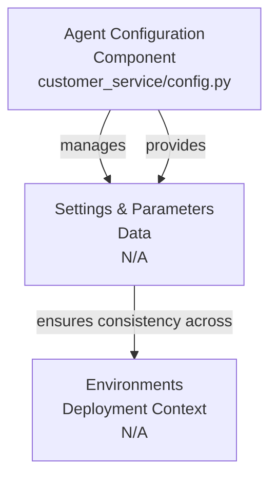
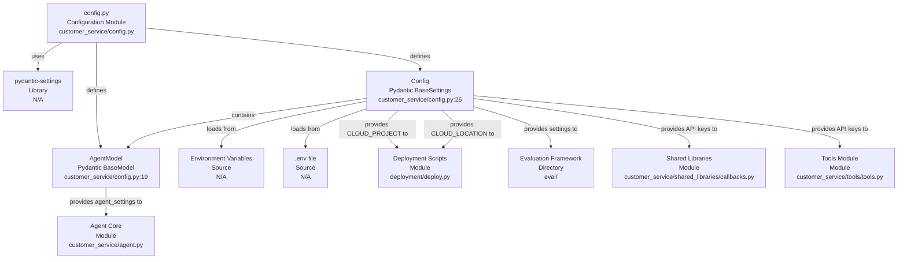

# Codebase Research Report

## Query
Investigate the "Agent Configuration" component in detail. Focus your analysis on these key files:
1. config.py (customer-service/customer_service/config.py)

Provide insights about the component's main responsibilities and functionality and how it integrates with other system components

## Answer
# Agent Configuration Component Analysis

## High-Level Overview

The **Agent Configuration** component is responsible for centralizing and managing the various settings and parameters required for the operation of the customer service agent. It acts as the single source of truth for configurable values, ensuring consistency and ease of management across different environments (e.g., development, staging, production). Its primary purpose is to provide a structured way to define, load, and access application-wide and agent-specific settings, abstracting away the details of how these settings are sourced (e.g., from environment variables or configuration files).

## Component Details: `config.py`

The core of the Agent Configuration component is the [config.py](customer_service/config.py) file. This file defines the data structures and logic for loading configuration settings.

### Purpose and Internal Structure

The [config.py](customer_service/config.py) module leverages `pydantic-settings` to define a robust and type-safe configuration system. It contains two key classes:

*   **`AgentModel`**: This [Pydantic BaseModel](customer_service/config.py:19) defines settings specific to the agent's operational characteristics.
    *   `name`: The name of the agent, defaulting to "customer_service_agent" [customer_service/config.py:22].
    *   `model`: The generative AI model to be used by the agent, defaulting to "gemini-2.5-flash" [customer_service/config.py:23].

*   **`Config`**: This [Pydantic BaseSettings](customer_service/config.py:26) class encapsulates all application-wide configuration settings. It is designed to load values from environment variables, optionally prefixed with "GOOGLE_", and from a `.env` file located relative to the module [customer_service/config.py:28-33].
    *   `agent_settings`: An instance of `AgentModel`, allowing nested configuration of agent-specific parameters [customer_service/config.py:34].
    *   `app_name`: The name of the application, set to "customer_service_app" [customer_service/config.py:35].
    *   `CLOUD_PROJECT`: The Google Cloud project ID, defaulting to "my_project" [customer_service/config.py:36].
    *   `CLOUD_LOCATION`: The Google Cloud region, defaulting to "us-central1" [customer_service/config.py:37].
    *   `GENAI_USE_VERTEXAI`: A flag indicating whether to use Vertex AI for generative AI operations, defaulting to "1" [customer_service/config.py:38].
    *   `API_KEY`: An optional API key, defaulting to an empty string [customer_service/config.py:39].

The module also initializes basic logging using Python's `logging` module [customer_service/config.py:15-16].

### Integration with Other System Components

The **Agent Configuration** component, primarily through the `Config` object defined in [config.py](customer_service/config.py), integrates with various other parts of the system by providing them with necessary runtime parameters.

*   **Agent Core (`agent.py`)**: The `agent_settings` within the `Config` object are crucial for the main agent logic defined in [customer_service/agent.py](customer_service/agent.py). This includes the agent's name and, critically, the specific generative AI model it should utilize for its operations.
*   **Deployment Scripts (`deploy.py`)**: Cloud-related settings such as `CLOUD_PROJECT` and `CLOUD_LOCATION` are essential for the deployment process, likely consumed by scripts like [deployment/deploy.py](deployment/deploy.py) to correctly provision and configure cloud resources.
*   **Evaluation Framework (`eval/`)**: The evaluation components, such as those found in the [eval/](eval/) directory, might use configuration settings to determine which agent model to test or which cloud project to target for evaluation runs.
*   **Shared Libraries and Tools**: Any shared libraries or tools within the agent's ecosystem (e.g., [customer_service/shared_libraries/callbacks.py](customer_service/shared_libraries/callbacks.py) or [customer_service/tools/tools.py](customer_service/tools/tools.py)) that interact with external services or require specific API keys would retrieve these from the `Config` object, ensuring consistent access to credentials and service endpoints.

By centralizing configuration, the system maintains a clear separation of concerns, allowing operational parameters to be managed independently of the core business logic.

---
*Generated by [CodeViz.ai](https://codeviz.ai) on 10/07/2025, 08:03:13*
