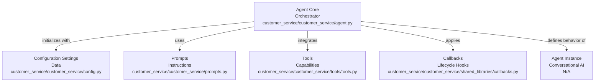

# Codebase Research Report

## Query
Investigate the "Agent Core" component in detail. Focus your analysis on these key files:
1. agent.py (customer-service/customer_service/agent.py)

Provide insights about the component's main responsibilities and functionality and how it integrates with other system components

## Answer
# Agent Core Component Analysis

## High-Level Architecture

The **Agent Core** component, primarily defined by the [agent.py](customer_service/customer_service/agent.py) file, serves as the central orchestrator for the customer service agent. Its main responsibility is to initialize and configure the `Agent` instance, integrating various sub-components such as configuration settings, prompts, tools, and callback mechanisms to define the agent's behavior and capabilities. It acts as the entry point for the agent's operational logic, bringing together all necessary elements for it to function as a conversational AI.

## Agent Core: `agent.py`

```mermaid
graph TB
  agentPy["agent.py<br>Agent Core<br>customer_service/customer_service/agent.py"]
  configObj["Config Object<br>Settings<br>customer_service/customer_service/config.py"]
  globalInstruction["GLOBAL_INSTRUCTION<br>Prompt<br>customer_service/customer_service/prompts.py"]
  instruction["INSTRUCTION<br>Prompt<br>customer_service/customer_service/prompts.py"]
  toolsList["Tools List<br>Capabilities<br>customer_service/customer_service/tools/tools.py"]
  rateLimitCallback["rate_limit_callback<br>Callback<br>customer_service/customer_service/shared_libraries/callbacks.py"]
  beforeAgentCallback["before_agent<br>Callback<br>customer_service/customer_service/shared_libraries/callbacks.py"]
  beforeToolCallback["before_tool<br>Callback<br>customer_service/customer_service/shared_libraries/callbacks.py"]
  afterToolCallback["after_tool<br>Callback<br>customer_service/customer_service/shared_libraries/callbacks.py"]
  rootAgent["root_agent<br>Agent Instance<br>N/A"]
  googleAdk["google.adk<br>Framework<br>N/A"]
  agentPy --> |"loads"| configObj
  agentPy --> |"imports"| globalInstruction
  agentPy --> |"imports"| instruction
  agentPy --> |"registers"| toolsList
  agentPy --> |"assigns"| rateLimitCallback
  agentPy --> |"assigns"| beforeAgentCallback
  agentPy --> |"assigns"| beforeToolCallback
  agentPy --> |"assigns"| afterToolCallback
  agentPy --> |"instantiates"| rootAgent
  rootAgent --> |"uses"| googleAdk
```

The [agent.py](customer_service/customer_service/agent.py) file is crucial for setting up the agent's operational parameters and integrating its various functionalities.

### Purpose
The primary purpose of [agent.py](customer_service/customer_service/agent.py) is to instantiate and configure the main `Agent` object, which is the core of the customer service agent. This involves defining the agent's model, instructions, name, and the set of tools it can utilize, along with various lifecycle callbacks.

### Internal Parts
*   **Configuration Loading**: It initializes a `Config` object from [config.py](customer_service/customer_service/config.py:15) to load agent-specific settings, such as the model to be used and the agent's name.
*   **Prompt Definitions**: It imports `GLOBAL_INSTRUCTION` and `INSTRUCTION` from [prompts.py](customer_service/customer_service/prompts.py) to provide the agent with its foundational and specific operational directives.
*   **Tool Integration**: A comprehensive list of tools, imported from [tools.py](customer_service/customer_service/tools/tools.py), are registered with the agent. These tools enable the agent to perform specific actions like `send_call_companion_link`, `approve_discount`, `update_salesforce_crm`, `access_cart_information`, and many others.
*   **Callback Mechanisms**: Various callback functions (`rate_limit_callback`, `before_agent`, `before_tool`, `after_tool`) are imported from [callbacks.py](customer_service/customer_service/shared_libraries/callbacks.py) and assigned to the agent's lifecycle events. These callbacks allow for custom logic to be executed at different stages of the agent's operation, such as before tool execution or after agent processing.
*   **Agent Instantiation**: The `root_agent` instance is created using the `Agent` class from the `google.adk` library, consolidating all the above-mentioned components.

### External Relationships and Integration
The **Agent Core** component integrates with several other system components:

*   **Configuration Management**: It depends on the [Config](customer_service/customer_service/config.py) class to retrieve runtime settings for the agent, ensuring that the agent's behavior is configurable without modifying the core logic.
*   **Prompt Management**: It utilizes instructions defined in [prompts.py](customer_service/customer_service/prompts.py) to guide the agent's conversational flow and decision-making process.
*   **Tooling System**: It directly incorporates a suite of specialized tools from [tools.py](customer_service/customer_service/tools/tools.py). These tools represent the agent's capabilities to interact with external systems or perform specific actions (e.g., CRM updates, cart modifications, scheduling).
*   **Shared Libraries (Callbacks)**: It leverages callback functions from [callbacks.py](customer_service/customer_service/shared_libraries/callbacks.py) to implement cross-cutting concerns such as rate limiting and logging at different stages of the agent's execution.
*   **ADK Framework**: The core `Agent` class itself is provided by the `google.adk` library, indicating a strong dependency on this framework for the agent's fundamental architecture and operational model.

---
*Generated by [CodeViz.ai](https://codeviz.ai) on 10/07/2025, 08:01:44*
