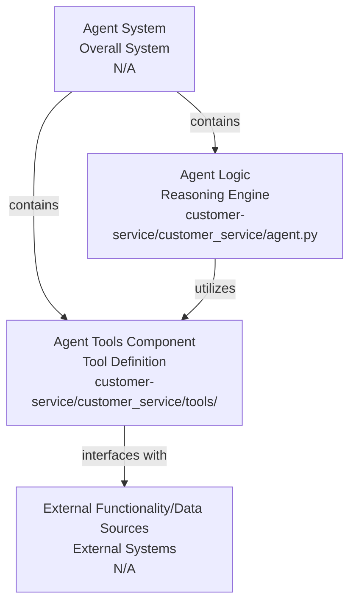
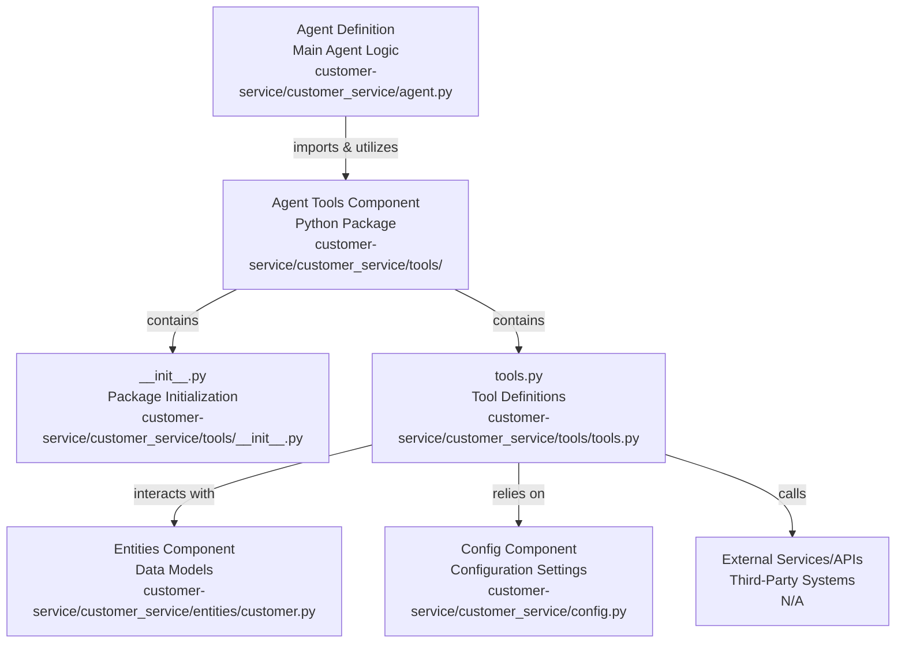

# Codebase Research Report

## Query
Investigate the "Agent Tools" component in detail. Focus your analysis on these key files:
1. __init__.py (customer-service/customer_service/tools/__init__.py)
2. tools.py (customer-service/customer_service/tools/tools.py)

Provide insights about the component's main responsibilities and functionality and how it integrates with other system components

## Answer
# Agent Tools Component Analysis

## High-Level Architecture

The **Agent Tools** component, located within the `customer_service` package, is a crucial part of the overall agent system. Its primary responsibility is to define and expose a set of callable functions (tools) that the agent can utilize to perform specific actions or retrieve information. These tools act as an interface between the agent's reasoning capabilities and external functionalities or data sources. The component integrates with the main agent logic by providing the necessary tools for its operation, allowing the agent to interact with various parts of the system or external services.

## Agent Tools Component

The **Agent Tools** component is defined within the `customer_service/tools` directory. It serves as a container for all the tools available to the customer service agent.

### Purpose
The main purpose of this component is to encapsulate and organize the specific functionalities that the agent can invoke during a conversation or task execution. By abstracting these functionalities into tools, the agent's core logic remains clean and focused on decision-making, delegating specific actions to these specialized tools.

### Internal Parts

The **Agent Tools** component primarily consists of the following files:

*   **`__init__.py`**: This file [initializes the `tools` package](customer-service/customer_service/tools/__init__.py). While it might be empty or contain simple imports, its presence signifies that `tools` is a Python package, allowing its contents to be imported and used by other modules. In this specific case, it's likely used to expose the tools defined in `tools.py` for easier import.

*   **`tools.py`**: This is the [core file](customer-service/customer_service/tools/tools.py) where the actual tools are defined. It contains the implementation of various functions that the agent can call. Each function typically performs a specific task, such as retrieving customer information, updating a service request, or accessing a knowledge base.

    *   **Functionality**: The `tools.py` file is expected to contain Python functions decorated or structured in a way that makes them discoverable and callable by the agent framework. These functions will likely interact with other parts of the system, such as the `entities` component for data models or external APIs.

### External Relationships

The **Agent Tools** component integrates with other system components in the following ways:

*   **`customer_service.agent.py`**: The main [agent definition](customer-service/customer_service/agent.py) will import and utilize the tools defined in this component. The agent's reasoning engine will decide which tool to use based on the user's query and the current context, and then invoke the appropriate function from the **Agent Tools** component.

*   **`customer_service.entities.customer.py`**: Tools might interact with [data models defined in the `entities` component](customer-service/customer_service/entities/customer.py), such as `Customer` objects, to retrieve or update customer-related information. For example, a tool to "get customer details" would likely query a database and return a `Customer` entity.

*   **`customer_service.config.py`**: Tools might rely on [configuration settings](customer-service/customer_service/config.py) defined in the `config.py` file, such as API keys, database connection strings, or service endpoints, to perform their operations.

*   **External Services/APIs**: The functions within `tools.py` are likely to make calls to external services or APIs (e.g., CRM systems, order management systems, knowledge bases) to fulfill their responsibilities. These interactions are abstracted away by the tool functions, providing a clean interface for the agent.

---
*Generated by [CodeViz.ai](https://codeviz.ai) on 10/07/2025, 08:05:14*
