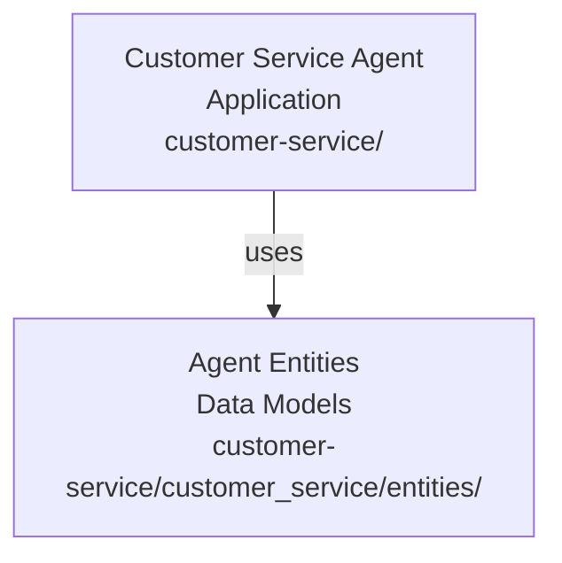
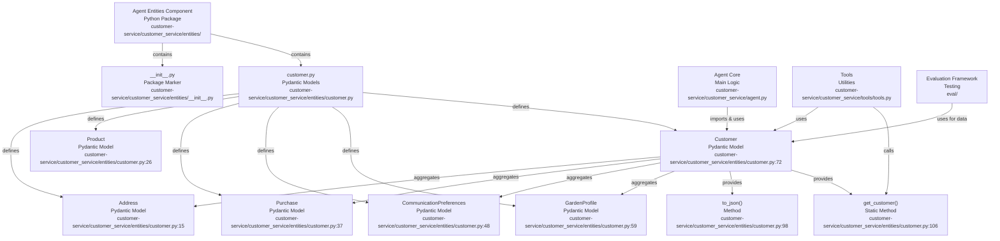

# Codebase Research Report

## Query
Investigate the "Agent Entities" component in detail. Focus your analysis on these key files:
1. customer.py (customer-service/customer_service/entities/customer.py)
2. __init__.py (customer-service/customer_service/entities/__init__.py)

Provide insights about the component's main responsibilities and functionality and how it integrates with other system components

## Answer
# Codebase Analysis Report: Agent Entities Component

## High-Level Architecture

The **customer-service** agent is designed to handle customer interactions, likely involving retrieving, processing, and presenting customer-specific information. Within this architecture, the **Agent Entities** component serves as the foundational layer for defining the data structures that represent various aspects of a customer. This component ensures a standardized and type-safe way to manage customer data across the agent's functionalities.

## Agent Entities Component

The **Agent Entities** component, primarily located in the [customer_service/entities](customer_service/entities/) directory, is responsible for defining the core data models (entities) used throughout the customer service agent. Its main responsibility is to provide a structured and validated representation of customer-related information, facilitating consistent data handling and communication between different parts of the system.

### Internal Structure and Functionality

This component contains the following key files:

*   **[customer_service/entities/__init__.py](customer_service/entities/__init__.py)**: This file marks the `entities` directory as a Python package, allowing its modules to be imported and used by other parts of the application. It does not contain any specific entity definitions itself.

*   **[customer_service/entities/customer.py](customer_service/entities/customer.py)**: This is the central file for defining customer-related data models using Pydantic, which provides data validation and serialization capabilities. It encapsulates various facets of customer information into distinct, well-defined structures.

    The file defines the following Pydantic models:

    *   **`Address`** [customer_service/entities/customer.py:15]: Represents a customer's physical address, including `street`, `city`, `state`, and `zip`.
    *   **`Product`** [customer_service/entities/customer.py:26]: Describes a product, typically used within a purchase history, with `product_id`, `name`, and `quantity`.
    *   **`Purchase`** [customer_service/entities/customer.py:37]: Represents a single customer purchase, containing the `date`, a list of `items` (of type `Product`), and the `total_amount`.
    *   **`CommunicationPreferences`** [customer_service/entities/customer.py:48]: Defines a customer's preferences for receiving communications (e.g., `email`, `sms`, `push_notifications`).
    *   **`GardenProfile`** [customer_service/entities/customer.py:59]: Captures specific details about a customer's garden, such as `type`, `size`, `sun_exposure`, `soil_type`, and `interests`.
    *   **`Customer`** [customer_service/entities/customer.py:72]: This is the primary entity model, aggregating all other related models to form a comprehensive customer profile. It includes fields like `account_number`, `customer_id`, `customer_first_name`, `customer_last_name`, `email`, `phone_number`, `billing_address` (an `Address` object), `purchase_history` (a list of `Purchase` objects), `loyalty_points`, `preferred_store`, `communication_preferences` (a `CommunicationPreferences` object), `garden_profile` (a `GardenProfile` object), and `scheduled_appointments`.

    The `Customer` model also provides:
    *   A `to_json` method [customer_service/entities/customer.py:98] for serializing the customer object into a JSON string.
    *   A static method `get_customer` [customer_service/entities/customer.py:106] which, in this example, provides dummy customer data based on a `customer_id`. In a production environment, this method would typically interact with a database or external API to retrieve actual customer information.

### Integration with Other System Components

The entities defined within this component are fundamental to the operation of the customer service agent. They serve as the canonical data types for representing customer information, enabling seamless data exchange and processing across various modules.

*   **Agent Core (`agent.py`)**: The main agent logic, likely defined in [customer_service/agent.py](customer_service/agent.py), would import and utilize these customer entities to manage customer sessions, process queries related to customer data, and formulate responses. For instance, when a user asks for a customer's purchase history, the agent would retrieve data and map it to the `Customer` and `Purchase` models.
*   **Tools (`tools.py`)**: Any tools developed for the agent (e.g., in [customer_service/tools/tools.py](customer_service/tools/tools.py)) that interact with customer data (e.g., looking up customer details, updating preferences, scheduling appointments) would rely on these defined entity structures for input and output. The `get_customer` method in `customer.py` is an example of a function that a tool might call to retrieve customer data.
*   **Configuration (`config.py`)**: While not directly importing entities, the configuration (e.g., [customer_service/config.py](customer_service/config.py)) might define parameters or settings that influence how customer data is handled or where it is sourced from, indirectly supporting the use of these entities.
*   **Evaluation (`eval/`)**: The evaluation framework (e.g., in [eval/test_eval.py](eval/test_eval.py) or [eval/eval_data/](eval/eval_data/)) would likely use these customer entities to define test cases, simulate customer interactions, and validate the agent's responses based on structured customer data. For example, `full_conversation.test.json` or `simple.test.json` might contain data that maps to these customer entities.

---
*Generated by [CodeViz.ai](https://codeviz.ai) on 10/07/2025, 08:02:29*
