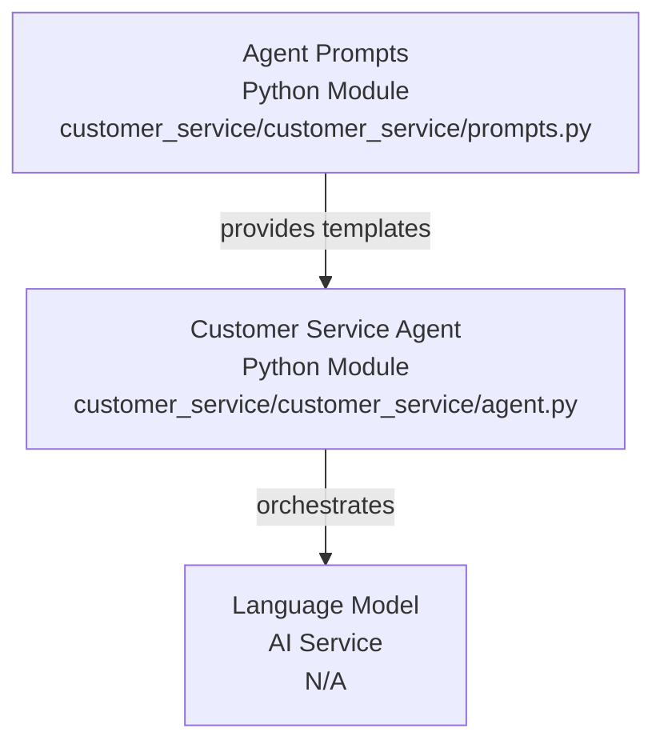
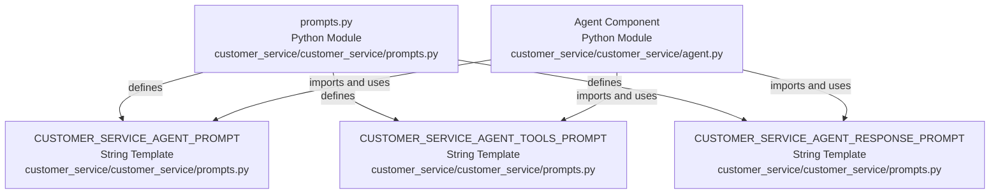

# Codebase Research Report

## Query
Investigate the "Agent Prompts" component in detail. Focus your analysis on these key files:
1. prompts.py (customer-service/customer_service/prompts.py)

Provide insights about the component's main responsibilities and functionality and how it integrates with other system components

## Answer
# Codebase Analysis Report: Agent Prompts Component

## High-Level Architecture

The **Agent Prompts** component, primarily defined within the [customer_service/prompts.py](customer_service/customer_service/prompts.py) file, serves as the central repository for all prompt templates used by the **Customer Service Agent**. Its main purpose is to encapsulate and manage the textual instructions, context, and examples that guide the agent's language model in generating appropriate responses and performing its tasks. This component acts as a foundational layer, providing the necessary linguistic scaffolding for the agent's conversational abilities.

The prompts defined here are consumed by the main **Agent** component ([customer_service/agent.py](customer_service/customer_service/agent.py)), which orchestrates the overall customer service workflow. The agent uses these prompts to define its persona, understand user queries, generate responses, and interact with various tools.

## Agent Prompts Component

### Purpose
The **Agent Prompts** component is responsible for defining and organizing the various prompt templates that shape the behavior and responses of the customer service agent. It centralizes prompt management, making it easier to modify, extend, and maintain the agent's conversational capabilities without altering core logic.

### Internal Parts
The [prompts.py](customer_service/customer_service/prompts.py) file contains several string variables, each representing a specific prompt template. These templates often include placeholders that are dynamically filled with context during runtime.

Key prompt templates include:

*   **`CUSTOMER_SERVICE_AGENT_PROMPT`**: This is the core system prompt that defines the agent's persona, its primary goal (providing excellent customer service), and general instructions for interaction. It sets the overall tone and behavioral guidelines for the agent.
*   **`CUSTOMER_SERVICE_AGENT_TOOLS_PROMPT`**: This prompt likely provides instructions to the agent on how to use the available tools, describing their purpose and expected input/output. It guides the agent in leveraging external functionalities.
*   **`CUSTOMER_SERVICE_AGENT_RESPONSE_PROMPT`**: This prompt guides the agent on how to formulate its final responses to the user, ensuring they are helpful, polite, and directly address the customer's query.

### External Relationships

The **Agent Prompts** component primarily interacts with the **Agent** component ([customer_service/agent.py](customer_service/customer_service/agent.py)). The `agent.py` file imports and utilizes the prompt templates defined in `prompts.py` to configure the language model and guide its behavior throughout the customer service interaction.

For example, the `agent.py` file would likely pass the `CUSTOMER_SERVICE_AGENT_PROMPT` to the language model as a system message, and use other prompts like `CUSTOMER_SERVICE_AGENT_TOOLS_PROMPT` to instruct the model on tool usage within its conversational turns. This clear separation of concerns allows the agent's logic to remain clean while its conversational style and capabilities are managed externally in the `prompts.py` file.

---
*Generated by [CodeViz.ai](https://codeviz.ai) on 10/07/2025, 08:03:43*
