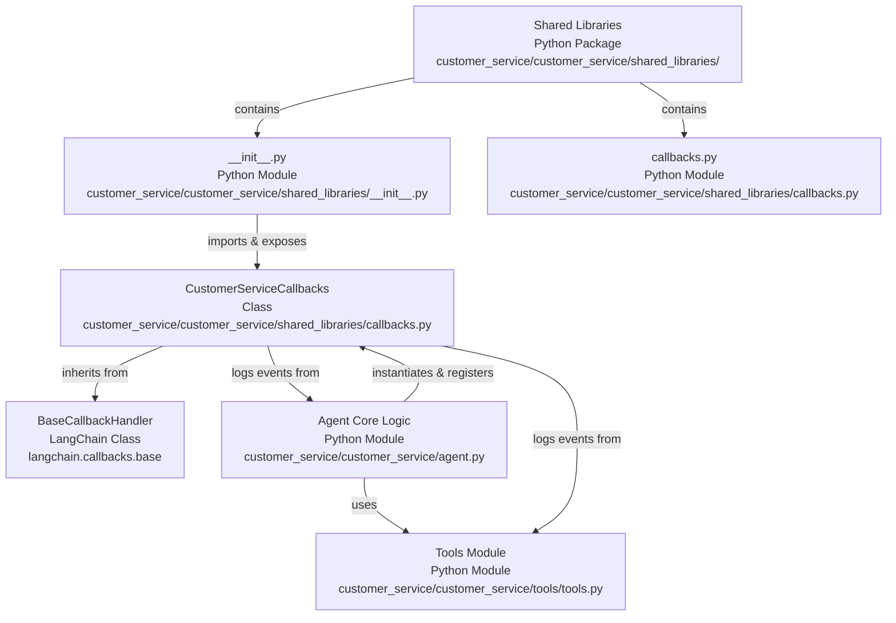

# Codebase Research Report

## Query
Investigate the "Shared Libraries" component in detail. Focus your analysis on these key files:
1. callbacks.py (customer-service/customer_service/shared_libraries/callbacks.py)
2. __init__.py (customer-service/customer_service/shared_libraries/__init__.py)

Provide insights about the component's main responsibilities and functionality and how it integrates with other system components

## Answer
# Codebase Analysis Report: Shared Libraries Component

## Shared Libraries Component

The **Shared Libraries** component, located at [customer_service/customer_service/shared_libraries/](customer_service/customer_service/shared_libraries/), serves as a centralized repository for common utilities and reusable functionalities that can be leveraged across different parts of the `customer_service` agent. Its primary responsibility is to promote code reusability and maintain consistency by encapsulating shared logic.

### Internal Structure and Key Files

The component contains the following key files:

*   [__init__.py](customer_service/customer_service/shared_libraries/__init__.py)
*   [callbacks.py](customer_service/customer_service/shared_libraries/callbacks.py)

### `__init__.py`

The [__init__.py](customer_service/customer_service/shared_libraries/__init__.py) file in the `shared_libraries` directory primarily serves to mark the directory as a Python package. In this specific instance, it also imports and exposes the `CustomerServiceCallbacks` class from [callbacks.py](customer_service/customer_service/shared_libraries/callbacks.py), making it directly accessible when `shared_libraries` is imported.

### `callbacks.py`

The [callbacks.py](customer_service/customer_service/shared_libraries/callbacks.py) file defines the `CustomerServiceCallbacks` class, which is designed to handle various callback events within the customer service agent's workflow. This class inherits from `BaseCallbackHandler` from `langchain.callbacks.base`, indicating its role in integrating with LangChain's callback system.

#### Purpose and Functionality

The `CustomerServiceCallbacks` class provides methods to log and process events that occur during the execution of the agent. These methods include:

*   `on_tool_start`: Called when a tool execution begins.
*   `on_tool_end`: Called when a tool execution ends.
*   `on_tool_error`: Called when a tool execution encounters an error.
*   `on_chain_start`: Called when a chain (e.g., an LLM chain) starts.
*   `on_chain_end`: Called when a chain ends.
*   `on_chain_error`: Called when a chain encounters an error.
*   `on_llm_start`: Called when an LLM (Large Language Model) call starts.
*   `on_llm_end`: Called when an LLM call ends.
*   `on_llm_error`: Called when an LLM call encounters an error.
*   `on_agent_action`: Called when an agent takes an action.
*   `on_agent_finish`: Called when an agent finishes its execution.

Each of these methods currently logs the event using `logging.info`, providing a detailed trace of the agent's operations. This is crucial for debugging, monitoring, and understanding the flow of the customer service agent.

#### Integration with Other System Components

The `CustomerServiceCallbacks` class integrates with other system components primarily through the **LangChain framework**. The agent's core logic, likely defined in [customer_service/customer_service/agent.py](customer_service/customer_service/agent.py), would instantiate and register an instance of `CustomerServiceCallbacks` to receive notifications about various events.

For example, when the agent uses a tool (defined in [customer_service/customer_service/tools/tools.py](customer_service/customer_service/tools/tools.py)) or interacts with an LLM, the corresponding `on_tool_*` or `on_llm_*` methods in `CustomerServiceCallbacks` would be invoked. This allows for centralized logging and potential custom handling of these events, such as:

*   **Monitoring and Observability:** Providing real-time insights into the agent's decision-making process and tool usage.
*   **Debugging:** Helping developers trace issues by logging the exact sequence of operations and their outcomes.
*   **Custom Logic:** Allowing for the injection of custom logic at various points in the agent's execution, such as saving conversation history, updating external systems, or triggering alerts.

The `shared_libraries` component, through `callbacks.py`, acts as a crucial integration point for observing and reacting to the dynamic behavior of the customer service agent.

---
*Generated by [CodeViz.ai](https://codeviz.ai) on 10/07/2025, 08:04:19*
