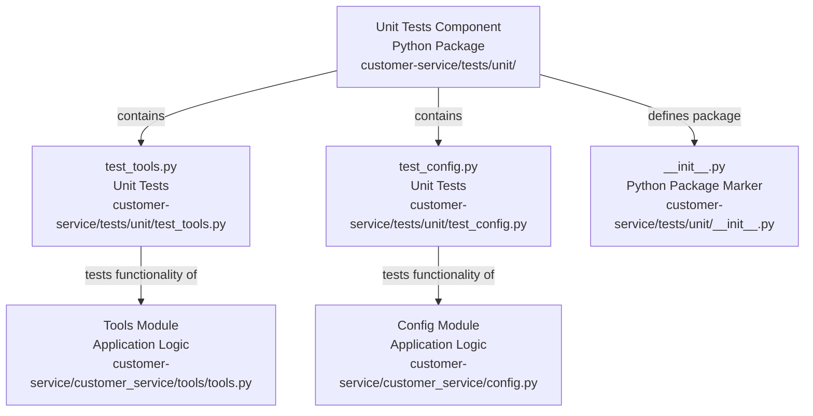

# Codebase Research Report

## Query
Investigate the "Unit Tests" component in detail. Focus your analysis on these key files:
1. test_tools.py (customer-service/tests/unit/test_tools.py)
2. test_config.py (customer-service/tests/unit/test_config.py)
3. __init__.py (customer-service/tests/unit/__init__.py)

Provide insights about the component's main responsibilities and functionality and how it integrates with other system components

## Answer
# Codebase Analysis Report: Unit Tests Component

## Unit Tests Component Overview

The **Unit Tests** component, primarily located within the [tests/unit](customer-service/tests/unit/) directory, is responsible for verifying the correctness and functionality of individual units or components of the `customer-service` application in isolation. Its main responsibility is to ensure that each function, method, or class behaves as expected, adhering to its specified requirements. This component acts as a crucial safety net, catching regressions and validating new feature implementations at a granular level.

### Internal Structure and Key Files

The `tests/unit` directory contains test modules that mirror the structure of the application's core components. Each test file typically focuses on a specific part of the application, ensuring that the testing is modular and easy to navigate.

*   **[test_tools.py](customer-service/tests/unit/test_tools.py)**: This file contains unit tests specifically for the tools defined in the `customer_service` application. It verifies the functionality of individual tools, ensuring they perform their intended operations correctly and handle various inputs and edge cases.
*   **[test_config.py](customer-service/tests/unit/test_config.py)**: This file is dedicated to testing the configuration management of the `customer_service` application. It ensures that configuration settings are loaded, parsed, and accessed correctly, and that default values or environment variable overrides are handled as expected.
*   **[__init__.py](customer-service/tests/unit/__init__.py)**: This file marks the `unit` directory as a Python package. While it might be empty or contain package-level initialization code, its primary role in this context is to allow Python to recognize and import modules (like `test_tools` and `test_config`) from within the `tests.unit` package.

### Integration with Other System Components

The **Unit Tests** component integrates directly with the core application components by importing and exercising their functionalities. It does not directly modify or interact with external systems during testing; instead, it focuses on the internal logic of the application's units.

*   **Integration with [customer_service/tools/tools.py](customer-service/customer_service/tools/tools.py)**: The [test_tools.py](customer-service/tests/unit/test_tools.py) file directly imports and tests functions and classes defined in [customer_service/tools/tools.py](customer-service/customer_service/tools/tools.py). This ensures that the tools used by the customer service agent (e.g., for interacting with external APIs or performing specific actions) are robust and reliable.
*   **Integration with [customer_service/config.py](customer-service/customer_service/config.py)**: The [test_config.py](customer-service/tests/unit/test_config.py) file interacts with the configuration logic implemented in [customer_service/config.py](customer-service/customer_service/config.py). It validates how the application's settings are managed, which is critical for the correct operation of all other components that rely on these settings.

In essence, the **Unit Tests** component serves as a quality assurance layer, providing confidence that the foundational building blocks of the `customer-service` application are sound before they are integrated into larger features or deployed.

---
*Generated by [CodeViz.ai](https://codeviz.ai) on 10/07/2025, 08:00:28*
