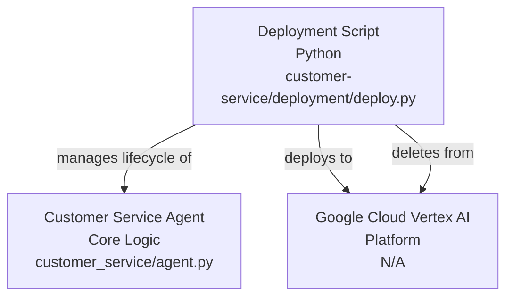
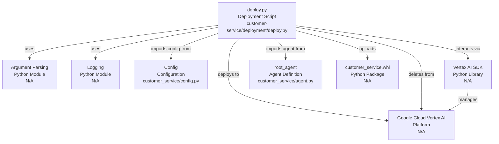

# Codebase Research Report

## Query
Investigate the "Deployment Script" component in detail. Focus your analysis on these key files:
1. deploy.py (customer-service/deployment/deploy.py)

Provide insights about the component's main responsibilities and functionality and how it integrates with other system components

## Answer
# Deployment Script Component Analysis

## High-Level Architecture

The **Deployment Script** component, primarily embodied by [deploy.py](customer-service/deployment/deploy.py), is responsible for managing the lifecycle of the customer service agent within the Google Cloud Vertex AI platform. Its main purpose is to deploy the agent as a Vertex AI Agent Engine or to delete an existing deployed agent. It integrates with the core agent logic and configuration to facilitate its operationalization in the cloud environment.

## Deployment Script ([deployment/deploy.py](customer-service/deployment/deploy.py))

The [deploy.py](customer-service/deployment/deploy.py) script serves as the primary interface for deploying and managing the **Customer Service Agent** on Vertex AI.

### Purpose
The script's main purpose is to automate the deployment and deletion of the customer service agent, making it accessible as a managed service on Google Cloud's Vertex AI platform.

### Internal Parts
The script utilizes several key modules and components:
*   **Argument Parsing**: It uses the `argparse` module to handle command-line arguments, allowing users to specify whether to deploy or delete an agent, and to provide the resource ID for deletion [deploy.py](customer-service/deployment/deploy.py:30-43).
*   **Logging**: Standard Python `logging` is used for outputting information and debugging messages during the deployment process [deploy.py](customer-service/deployment/deploy.py:19-20).
*   **Configuration**: It imports and uses the `Config` class from [customer_service.config](customer_service/config.py) to retrieve project-specific settings like `CLOUD_PROJECT` and `CLOUD_LOCATION` [deploy.py](customer-service/deployment/deploy.py:22).
*   **Vertex AI SDK**: It heavily relies on the `vertexai` SDK, specifically `vertexai.agent_engines` and `vertexai.preview.reasoning_engines.AdkApp`, to interact with the Vertex AI platform for agent management [deploy.py](customer-service/deployment/deploy.py:13-15).
*   **Agent Definition**: It imports `root_agent` from [customer_service.agent](customer_service/agent.py), which represents the core logic of the customer service agent to be deployed [deploy.py](customer_service/deployment/deploy.py:12).

### Functionality
The script provides two main functionalities based on command-line arguments:

1.  **Agent Deletion**: If the `--delete` argument is provided, the script attempts to delete an agent specified by its `--resource_id`. It uses `agent_engines.get` to check for the agent's existence and `agent_engines.delete` to remove it [deploy.py](customer-service/deployment/deploy.py:47-53).
2.  **Agent Deployment**: If `--delete` is not specified, the script proceeds with deployment.
    *   It initializes the Vertex AI environment using project and location details from the [Config](customer_service/config.py) [deploy.py](customer-service/deployment/deploy.py:26-29).
    *   It creates an `AdkApp` instance, wrapping the `root_agent` [deploy.py](customer-service/deployment/deploy.py:57).
    *   It then uses `agent_engines.create` to deploy the `AdkApp` to Vertex AI, specifying the agent's wheel file (`AGENT_WHL_FILE`) as a requirement [deploy.py](customer-service/deployment/deploy.py:60-65).
    *   After deployment, it performs a basic test by creating a session and streaming a query to the newly deployed agent to confirm successful operation [deploy.py](customer-service/deployment/deploy.py:67-73).

### External Relationships
The [deploy.py](customer-service/deployment/deploy.py) script interacts with the following external components:
*   **Google Cloud Vertex AI**: This is the primary external dependency. The script deploys and manages the agent as a Vertex AI Agent Engine, leveraging Vertex AI's capabilities for hosting and running the agent.
*   **Customer Service Agent Core**: It directly uses the `root_agent` defined in [customer_service/agent/agent.py](customer_service/agent/agent.py) as the application logic to be deployed.
*   **Configuration Management**: It reads configuration parameters from [customer_service/config.py](customer_service/config.py) to set up the Vertex AI environment and other deployment-related settings.
*   **Python Package (`.whl` file)**: The script references `customer_service-0.1.0-py3-none-any.whl` [deploy.py](customer-service/deployment/deploy.py:24) as the package containing the agent's dependencies and code, which is uploaded to Vertex AI during deployment.

---
*Generated by [CodeViz.ai](https://codeviz.ai) on 10/07/2025, 08:00:00*
