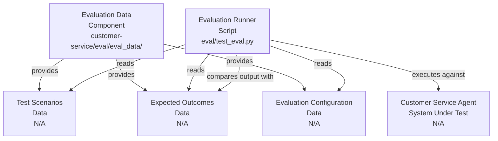
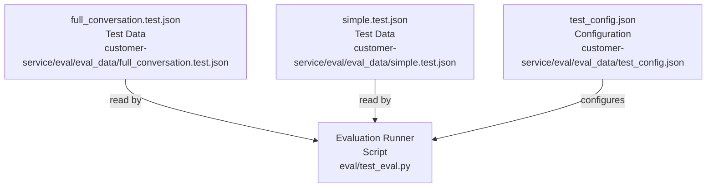

# Codebase Research Report

## Query
Investigate the "Evaluation Data" component in detail. Focus your analysis on these key files:
1. full_conversation.test.json (customer-service/eval/eval_data/full_conversation.test.json)
2. simple.test.json (customer-service/eval/eval_data/simple.test.json)
3. test_config.json (customer-service/eval/eval_data/test_config.json)

Provide insights about the component's main responsibilities and functionality and how it integrates with other system components

## Answer
# Evaluation Data Component Analysis

The **Evaluation Data** component, primarily located within the [customer-service/eval/eval_data/](customer-service/eval/eval_data/) directory, serves as the repository for test data and configuration used during the evaluation of the customer service agent. Its main responsibility is to provide structured input for testing the agent's performance against predefined scenarios and expected outputs. This component is crucial for validating the agent's behavior, ensuring it responds correctly to various conversational flows, and maintaining the quality of the agent's responses over time.

## Component Responsibilities and Functionality

The **Evaluation Data** component provides the necessary inputs for the evaluation process, which is likely orchestrated by the [eval/test_eval.py](eval/test_eval.py) script. It defines:
*   **Test Scenarios:** Different conversational flows or single-turn interactions that the agent should handle.
*   **Expected Outcomes:** The anticipated responses or actions from the agent for each scenario.
*   **Evaluation Configuration:** Settings that control how the evaluation is performed, such as metrics to collect or specific test cases to run.

### Integration with System Components

The **Evaluation Data** component integrates primarily with the **Evaluation Runner** (e.g., [eval/test_eval.py](eval/test_eval.py)). The runner reads the test data and configuration from this component, executes the agent against the defined scenarios, and then compares the agent's actual output with the expected outcomes. This feedback loop is essential for iterative development and quality assurance of the customer service agent.

## Key Files in Detail

### 1. `full_conversation.test.json`

This file, located at [customer-service/eval/eval_data/full_conversation.test.json](customer-service/eval/eval_data/full_conversation.test.json), contains a comprehensive, multi-turn conversation scenario designed to test the agent's ability to maintain context and respond appropriately throughout a longer interaction.

*   **Purpose:** To evaluate the agent's performance in handling complex, extended conversational flows, including turn-taking, context retention, and multi-step problem resolution.
*   **Internal Structure:** It typically contains an array of conversation turns, where each turn specifies the user's input and the expected agent response. It might also include metadata about the conversation, such as a unique ID or a description of the scenario.
*   **External Relationships:** This file is read by the **Evaluation Runner** ([eval/test_eval.py](eval/test_eval.py)) to simulate a full conversation with the agent.

### 2. `simple.test.json`

The file [customer-service/eval/eval_data/simple.test.json](customer-service/eval/eval_data/simple.test.json) provides simpler, often single-turn, test cases.

*   **Purpose:** To test specific functionalities or agent responses in isolation, ensuring that basic interactions and common queries are handled correctly without the complexity of a full conversation. This is useful for quick sanity checks and focused testing of individual features.
*   **Internal Structure:** Similar to `full_conversation.test.json`, but with fewer turns per test case, often just a single user input and expected agent output.
*   **External Relationships:** Like `full_conversation.test.json`, this file is consumed by the **Evaluation Runner** ([eval/test_eval.py](eval/test_eval.py)) to execute simple test scenarios.

### 3. `test_config.json`

The configuration for the evaluation process is defined in [customer-service/eval/eval_data/test_config.json](customer-service/eval/eval_data/test_config.json).

*   **Purpose:** To configure the overall evaluation run, specifying which test data files to use, what metrics to collect, and potentially other parameters related to the evaluation environment or reporting.
*   **Internal Structure:** This file likely contains key-value pairs or structured objects that define:
    *   `test_cases`: A list of references to the test data files (e.g., `full_conversation.test.json`, `simple.test.json`).
    *   `metrics`: Definitions of performance metrics to be calculated (e.g., accuracy, response time).
    *   `evaluation_parameters`: Any other settings relevant to how the evaluation is conducted.
*   **External Relationships:** This configuration file is read by the **Evaluation Runner** ([eval/test_eval.py](eval/test_eval.py)) at the beginning of an evaluation run to determine the scope and parameters of the testing process. It dictates which test data files are loaded and how the results are processed.

---
*Generated by [CodeViz.ai](https://codeviz.ai) on 10/07/2025, 07:59:11*
