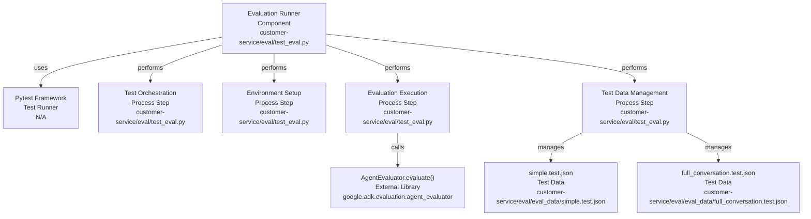
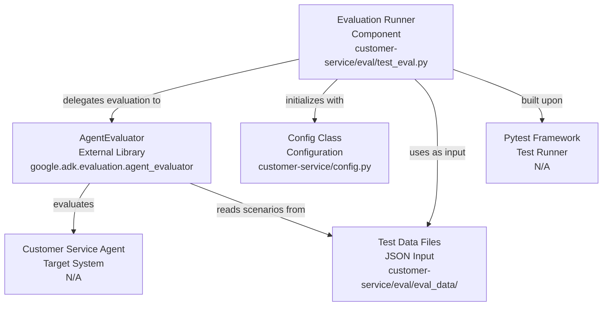

# Codebase Research Report

## Query
Investigate the "Evaluation Runner" component in detail. Focus your analysis on these key files:
1. test_eval.py (customer-service/eval/test_eval.py)

Provide insights about the component's main responsibilities and functionality and how it integrates with other system components

## Answer
# Evaluation Runner Component Analysis

The **Evaluation Runner** component is responsible for orchestrating and executing automated evaluations of the customer service agent. It leverages the `pytest` framework to define and run evaluation scenarios, ensuring the agent's functionality and performance meet expected standards.

## Core Responsibilities and Functionality

The primary responsibilities of the Evaluation Runner, as demonstrated by [test_eval.py](customer-service/eval/test_eval.py), include:

*   **Test Orchestration**: It defines specific test cases, such as `test_eval_simple` and `test_eval_full_conversation`, which serve as entry points for initiating agent evaluations. These tests are marked with `@pytest.mark.asyncio` to indicate their asynchronous nature.
*   **Environment Setup**: Before running evaluations, it ensures the necessary environment variables are loaded using `load_dotenv` from the `dotenv` library. This setup is handled by the `load_env` pytest fixture, which also initializes the application's `Config` object.
*   **Evaluation Execution**: It triggers the actual evaluation process by calling the static method `AgentEvaluator.evaluate`. This method is provided by the `google.adk.evaluation.agent_evaluator` library, indicating that the core evaluation logic resides externally.
*   **Test Data Management**: It specifies the paths to evaluation data files, such as [eval_data/simple.test.json](customer-service/eval/eval_data/simple.test.json) and [eval_data/full_conversation.test.json](customer-service/eval/eval_data/full_conversation.test.json), which contain the conversation flows and expected outcomes for the agent.

## Integration with Other System Components

The Evaluation Runner integrates with several key components to perform its function:

*   **`AgentEvaluator`**: This is the central integration point. The Evaluation Runner delegates the actual agent evaluation to the `AgentEvaluator.evaluate` method, passing the agent's name ("customer_service") and the path to the test session file. This suggests that `AgentEvaluator` is responsible for loading the agent, running the conversation defined in the session file, and assessing its performance.
*   **`Config`**: The `Config` class, imported from [customer_service/config.py](customer_service/config.py), is initialized during the environment setup phase ([test_eval.py](customer-service/eval/test_eval.py:22)). This implies that the evaluation process or the agent itself might rely on configuration settings defined within this class.
*   **Test Data Files**: The Evaluation Runner directly utilizes JSON files located in the [eval_data](customer-service/eval/eval_data/) directory, such as [simple.test.json](customer-service/eval/eval_data/simple.test.json) and [full_conversation.test.json](customer-service/eval/eval_data/full_conversation.test.json). These files serve as input for the `AgentEvaluator`, providing the scenarios against which the agent is tested.
*   **`pytest` Framework**: The entire evaluation process is built upon the `pytest` testing framework. `pytest` manages the execution of test functions, fixtures, and reporting, providing the infrastructure for running the evaluations.

---
*Generated by [CodeViz.ai](https://codeviz.ai) on 10/07/2025, 07:58:25*
