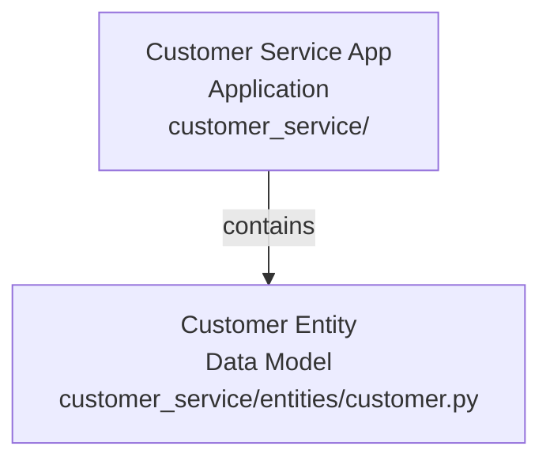
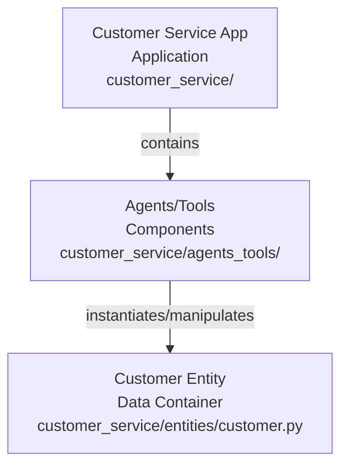
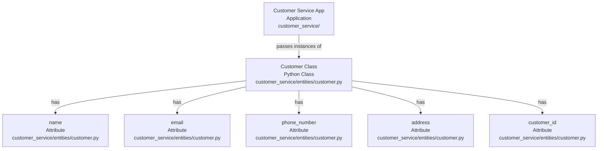

# Codebase Research Report

## Query
Investigate the "User" component in detail. Provide a comprehensive analysis of its architecture, responsibilities, and implementation details.

## Answer
# User Component Analysis

## High-Level Architecture

The "User" component, more specifically referred to as the **Customer** entity within this codebase, is a foundational data model residing within the `customer_service` application's `entities` module. Its primary role is to encapsulate the attributes and behaviors related to a customer, serving as a central data structure for customer-related information throughout the system.

## Mid-Level Component Interaction

The **Customer** entity ([customer_service/entities/customer.py](customer_service/entities/customer.py)) acts as a data container. It is likely instantiated and manipulated by other components within the `customer_service` application, such as agents or tools, to process customer-specific requests or manage customer data. Its attributes define the core information associated with a customer.

## Low-Level Implementation Details

The **Customer** component is implemented as a Python class named `Customer` within the file [customer_service/entities/customer.py](customer_service/entities/customer.py).

### Class: `Customer`

*   **Purpose:** Represents a customer with specific attributes. It serves as a data model for customer information.
*   **Internal Parts (Attributes):**
    *   `name`: The name of the customer.
    *   `email`: The email address of the customer.
    *   `phone_number`: The phone number of the customer.
    *   `address`: The physical address of the customer.
    *   `customer_id`: A unique identifier for the customer.
*   **External Relationships:** The `Customer` class is a standalone data entity. Its instances are likely passed between different parts of the `customer_service` application (e.g., from an agent to a tool, or stored/retrieved from a data source) to represent and operate on customer data. It does not appear to have direct dependencies on other custom classes within its definition, making it a self-contained data structure.

The implementation details can be found in:
[customer_service/entities/customer.py](customer_service/entities/customer.py)

---
*Generated by [CodeViz.ai](https://codeviz.ai) on 10/07/2025, 08:00:57*
