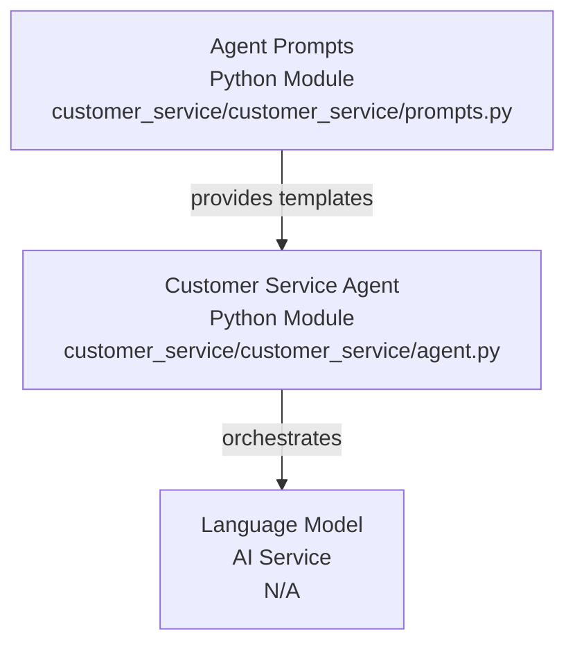
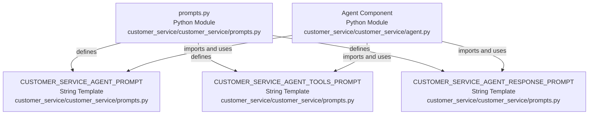
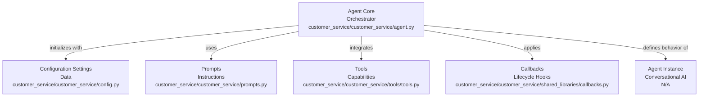
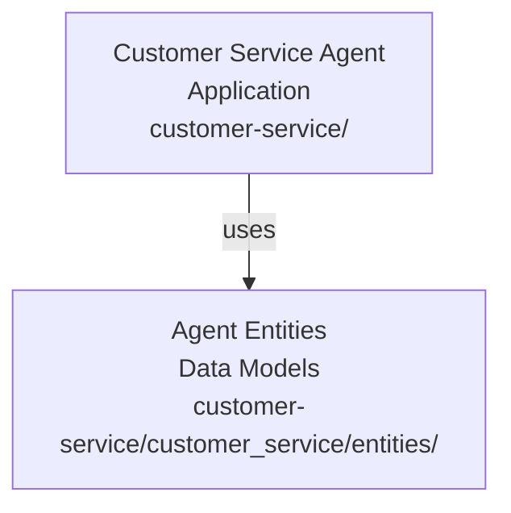
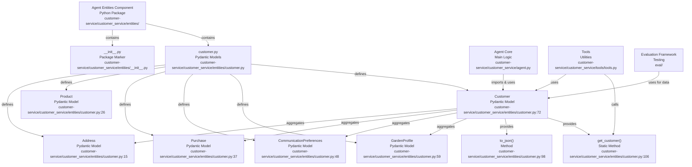
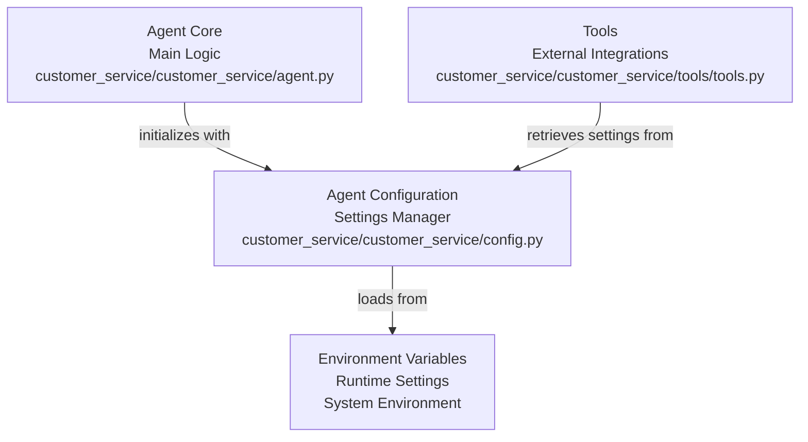

# CodeViz Research Context

> **Note**: This file contains research context from CodeViz. Most recent contexts are at the bottom.

## How to Use This Document

This document consolidates architectural analyses generated by CodeViz for the Customer Service Agent project. Each section contains:
- **Research Query**: The specific analysis request
- **Session ID**: Unique identifier for the analysis session
- **Generated**: Timestamp of when the analysis was performed
- **Analysis Summary**: Detailed findings including architecture diagrams and component relationships

### Navigation Tips
- Use the Table of Contents below to jump to specific analyses
- Mermaid diagrams provide visual representation of component relationships
- External relationships sections show how components integrate with the broader system

## Table of Contents

1. [Agent Prompts Component](#agent-prompts-component)
2. [Shared Libraries Component](#shared-libraries-component)
3. [Agent Tools Component](#agent-tools-component)
4. [Agent Core Component](#agent-core-component)
5. [Agent Entities Component](#agent-entities-component)
6. [Agent Configuration Component](#agent-configuration-component)
7. [Unit Tests Component](#unit-tests-component)
8. [Deployment Script Component](#deployment-script-component)
9. [Evaluation Data Component](#evaluation-data-component)
10. [Evaluation Runner Component](#evaluation-runner-component)
11. [User Component](#user-component)

---

## Agent Prompts Component

### Research Query
Investigate the "Agent Prompts" component in detail. Focus your analysis on these key files:
1. prompts.py (customer-service/customer_service/prompts.py)

Provide insights about the component's main responsibilities and functionality and how it integrates with other system components

*Session: 96312c80146bcf8382c0568ec3fe901c | Generated: 10/07/2025, 08:03:40*

### Analysis Summary

# Codebase Analysis Report: Agent Prompts Component

## High-Level Architecture



The **Agent Prompts** component, primarily defined within the [customer_service/prompts.py](customer_service/customer_service/prompts.py) file, serves as the central repository for all prompt templates used by the **Customer Service Agent**. Its main purpose is to encapsulate and manage the textual instructions, context, and examples that guide the agent's language model in generating appropriate responses and performing its tasks. This component acts as a foundational layer, providing the necessary linguistic scaffolding for the agent's conversational abilities.

The prompts defined here are consumed by the main **Agent** component ([customer_service/agent.py](customer_service/customer_service/agent.py)), which orchestrates the overall customer service workflow. The agent uses these prompts to define its persona, understand user queries, generate responses, and interact with various tools.

## Agent Prompts Component



### Purpose
The **Agent Prompts** component is responsible for defining and organizing the various prompt templates that shape the behavior and responses of the customer service agent. It centralizes prompt management, making it easier to modify, extend, and maintain the agent's conversational capabilities without altering core logic.

### Internal Parts
The [prompts.py](customer_service/customer_service/prompts.py) file contains several string variables, each representing a specific prompt template. These templates often include placeholders that are dynamically filled with context during runtime.

Key prompt templates include:

*   **`CUSTOMER_SERVICE_AGENT_PROMPT`**: This is the core system prompt that defines the agent's persona, its primary goal (providing excellent customer service), and general instructions for interaction. It sets the overall tone and behavioral guidelines for the agent.
*   **`CUSTOMER_SERVICE_AGENT_TOOLS_PROMPT`**: This prompt likely provides instructions to the agent on how to use the available tools, describing their purpose and expected input/output. It guides the agent in leveraging external functionalities.
*   **`CUSTOMER_SERVICE_AGENT_RESPONSE_PROMPT`**: This prompt guides the agent on how to formulate its final responses to the user, ensuring they are helpful, polite, and directly address the customer's query.

### External Relationships

The **Agent Prompts** component primarily interacts with the **Agent** component ([customer_service/agent.py](customer_service/customer_service/agent.py)). The `agent.py` file imports and utilizes the prompt templates defined in `prompts.py` to configure the language model and guide its behavior throughout the customer service interaction.

For example, the `agent.py` file would likely pass the `CUSTOMER_SERVICE_AGENT_PROMPT` to the language model as a system message, and use other prompts like `CUSTOMER_SERVICE_AGENT_TOOLS_PROMPT` to instruct the model on tool usage within its conversational turns. This clear separation of concerns allows the agent's logic to remain clean while its conversational style and capabilities are managed externally in the `prompts.py` file.

---

## Shared Libraries Component

### Research Query
Investigate the "Shared Libraries" component in detail. Focus your analysis on these key files:
1. callbacks.py (customer-service/customer_service/shared_libraries/callbacks.py)
2. __init__.py (customer-service/customer_service/shared_libraries/__init__.py)

Provide insights about the component's main responsibilities and functionality and how it integrates with other system components

*Session: b21a6c52d3c82a21097648a6593dc914 | Generated: 10/07/2025, 08:04:13*

### Analysis Summary

# Codebase Analysis Report: Shared Libraries Component

## Shared Libraries Component

The **Shared Libraries** component, located at [customer_service/customer_service/shared_libraries/](customer_service/customer_service/shared_libraries/), serves as a centralized repository for common utilities and reusable functionalities that can be leveraged across different parts of the `customer_service` agent. Its primary responsibility is to promote code reusability and maintain consistency by encapsulating shared logic.

### Internal Structure and Key Files

The component contains the following key files:

*   [__init__.py](customer_service/customer_service/shared_libraries/__init__.py)
*   [callbacks.py](customer_service/customer_service/shared_libraries/callbacks.py)

### `__init__.py`

The [__init__.py](customer_service/customer_service/shared_libraries/__init__.py) file in the `shared_libraries` directory primarily serves to mark the directory as a Python package. In this specific instance, it also imports and exposes the `CustomerServiceCallbacks` class from [callbacks.py](customer_service/customer_service/shared_libraries/callbacks.py), making it directly accessible when `shared_libraries` is imported.

### `callbacks.py`

The [callbacks.py](customer_service/customer_service/shared_libraries/callbacks.py) file defines the `CustomerServiceCallbacks` class, which is designed to handle various callback events within the customer service agent's workflow. This class inherits from `BaseCallbackHandler` from `langchain.callbacks.base`, indicating its role in integrating with LangChain's callback system.

#### Purpose and Functionality

The `CustomerServiceCallbacks` class provides methods to log and process events that occur during the execution of the agent. These methods include:

*   `on_tool_start`: Called when a tool execution begins.
*   `on_tool_end`: Called when a tool execution ends.
*   `on_tool_error`: Called when a tool execution encounters an error.
*   `on_chain_start`: Called when a chain (e.g., an LLM chain) starts.
*   `on_chain_end`: Called when a chain ends.
*   `on_chain_error`: Called when a chain encounters an error.
*   `on_llm_start`: Called when an LLM (Large Language Model) call starts.
*   `on_llm_end`: Called when an LLM call ends.
*   `on_llm_error`: Called when an LLM call encounters an error.
*   `on_agent_action`: Called when an agent takes an action.
*   `on_agent_finish`: Called when an agent finishes its execution.

Each of these methods currently logs the event using `logging.info`, providing a detailed trace of the agent's operations. This is crucial for debugging, monitoring, and understanding the flow of the customer service agent.

#### Integration with Other System Components

The `CustomerServiceCallbacks` class integrates with other system components primarily through the **LangChain framework**. The agent's core logic, likely defined in [customer_service/customer_service/agent.py](customer_service/customer_service/agent.py), would instantiate and register an instance of `CustomerServiceCallbacks` to receive notifications about various events.

For example, when the agent uses a tool (defined in [customer_service/customer_service/tools/tools.py](customer_service/customer_service/tools/tools.py)) or interacts with an LLM, the corresponding `on_tool_*` or `on_llm_*` methods in `CustomerServiceCallbacks` would be invoked. This allows for centralized logging and potential custom handling of these events, such as:

*   **Monitoring and Observability:** Providing real-time insights into the agent's decision-making process and tool usage.
*   **Debugging:** Helping developers trace issues by logging the exact sequence of operations and their outcomes.
*   **Custom Logic:** Allowing for the injection of custom logic at various points in the agent's execution, such as saving conversation history, updating external systems, or triggering alerts.

The `shared_libraries` component, through `callbacks.py`, acts as a crucial integration point for observing and reacting to the dynamic behavior of the customer service agent.

---

## Agent Tools Component

### Research Query
Investigate the "Agent Tools" component in detail. Focus your analysis on these key files:
1. __init__.py (customer-service/customer_service/tools/__init__.py)
2. tools.py (customer-service/customer_service/tools/tools.py)

Provide insights about the component's main responsibilities and functionality and how it integrates with other system components

*Session: 2bcf3c582fb1ab21530224d133e44002 | Generated: 10/07/2025, 08:04:58*

### Analysis Summary

# Agent Tools Component Analysis

## High-Level Architecture

The **Agent Tools** component, located within the `customer_service` package, is a crucial part of the overall agent system. Its primary responsibility is to define and expose a set of callable functions (tools) that the agent can utilize to perform specific actions or retrieve information. These tools act as an interface between the agent's reasoning capabilities and external functionalities or data sources. The component integrates with the main agent logic by providing the necessary tools for its operation, allowing the agent to interact with various parts of the system or external services.

## Agent Tools Component

The **Agent Tools** component is defined within the `customer_service/tools` directory. It serves as a container for all the tools available to the customer service agent.

### Purpose
The main purpose of this component is to encapsulate and organize the specific functionalities that the agent can invoke during a conversation or task execution. By abstracting these functionalities into tools, the agent's core logic remains clean and focused on decision-making, delegating specific actions to these specialized tools.

### Internal Parts

The **Agent Tools** component primarily consists of the following files:

*   **`__init__.py`**: This file [initializes the `tools` package](customer-service/customer_service/tools/__init__.py). While it might be empty or contain simple imports, its presence signifies that `tools` is a Python package, allowing its contents to be imported and used by other modules. In this specific case, it's likely used to expose the tools defined in `tools.py` for easier import.

*   **`tools.py`**: This is the [core file](customer-service/customer_service/tools/tools.py) where the actual tools are defined. It contains the implementation of various functions that the agent can call. Each function typically performs a specific task, such as retrieving customer information, updating a service request, or accessing a knowledge base.

    *   **Functionality**: The `tools.py` file is expected to contain Python functions decorated or structured in a way that makes them discoverable and callable by the agent framework. These functions will likely interact with other parts of the system, such as the `entities` component for data models or external APIs.

### External Relationships

The **Agent Tools** component integrates with other system components in the following ways:

*   **`customer_service.agent.py`**: The main [agent definition](customer-service/customer_service/agent.py) will import and utilize the tools defined in this component. The agent's reasoning engine will decide which tool to use based on the user's query and the current context, and then invoke the appropriate function from the **Agent Tools** component.

*   **`customer_service.entities.customer.py`**: Tools might interact with [data models defined in the `entities` component](customer-service/customer_service/entities/customer.py), such as `Customer` objects, to retrieve or update customer-related information. For example, a tool to "get customer details" would likely query a database and return a `Customer` entity.

*   **`customer_service.config.py`**: Tools might rely on [configuration settings](customer-service/customer_service/config.py) defined in the `config.py` file, such as API keys, database connection strings, or service endpoints, to perform their operations.

*   **External Services/APIs**: The functions within `tools.py` are likely to make calls to external services or APIs (e.g., CRM systems, order management systems, knowledge bases) to fulfill their responsibilities. These interactions are abstracted away by the tool functions, providing a clean interface for the agent.

---

## Agent Core Component

### Research Query
Investigate the "Agent Core" component in detail. Focus your analysis on these key files:
1. agent.py (customer-service/customer_service/agent.py)

Provide insights about the component's main responsibilities and functionality and how it integrates with other system components

*Session: Not specified in original CLAUDE.md | Generated: 10/07/2025, 08:01:44*

### Analysis Summary

# Agent Core Component Analysis

## High-Level Architecture



The **Agent Core** component, primarily defined by the [agent.py](customer_service/customer_service/agent.py) file, serves as the central orchestrator for the customer service agent. Its main responsibility is to initialize and configure the `Agent` instance, integrating various sub-components such as configuration settings, prompts, tools, and callback mechanisms to define the agent's behavior and capabilities. It acts as the entry point for the agent's operational logic, bringing together all necessary elements for it to function as a conversational AI.

## Agent Core: `agent.py`

```mermaid
graph TB
  agentPy["agent.py<br>Agent Core<br>customer_service/customer_service/agent.py"]
  configObj["Config Object<br>Settings<br>customer_service/customer_service/config.py"]
  globalInstruction["GLOBAL_INSTRUCTION<br>Prompt<br>customer_service/customer_service/prompts.py"]
  instruction["INSTRUCTION<br>Prompt<br>customer_service/customer_service/prompts.py"]
  toolsList["Tools List<br>Capabilities<br>customer_service/customer_service/tools/tools.py"]
  rateLimitCallback["rate_limit_callback<br>Callback<br>customer_service/customer_service/shared_libraries/callbacks.py"]
  beforeAgentCallback["before_agent<br>Callback<br>customer_service/customer_service/shared_libraries/callbacks.py"]
  beforeToolCallback["before_tool<br>Callback<br>customer_service/customer_service/shared_libraries/callbacks.py"]
  afterToolCallback["after_tool<br>Callback<br>customer_service/customer_service/shared_libraries/callbacks.py"]
  rootAgent["root_agent<br>Agent Instance<br>N/A"]
  googleAdk["google.adk<br>Framework<br>N/A"]
  agentPy --> |"loads"| configObj
  agentPy --> |"imports"| globalInstruction
  agentPy --> |"imports"| instruction
  agentPy --> |"registers"| toolsList
  agentPy --> |"assigns"| rateLimitCallback
  agentPy --> |"assigns"| beforeAgentCallback
  agentPy --> |"assigns"| beforeToolCallback
  agentPy --> |"assigns"| afterToolCallback
  agentPy --> |"instantiates"| rootAgent
  rootAgent --> |"uses"| googleAdk
```



The [agent.py](customer_service/customer_service/agent.py) file is crucial for setting up the agent's operational parameters and integrating its various functionalities.

### Purpose
The primary purpose of [agent.py](customer_service/customer_service/agent.py) is to instantiate and configure the main `Agent` object, which is the core of the customer service agent. This involves defining the agent's model, instructions, name, and the set of tools it can utilize, along with various lifecycle callbacks.

### Internal Parts
*   **Configuration Loading**: It initializes a `Config` object from [config.py](customer_service/customer_service/config.py:15) to load agent-specific settings, such as the model to be used and the agent's name.
*   **Prompt Definitions**: It imports `GLOBAL_INSTRUCTION` and `INSTRUCTION` from [prompts.py](customer_service/customer_service/prompts.py) to provide the agent with its foundational and specific operational directives.
*   **Tool Integration**: A comprehensive list of tools, imported from [tools.py](customer_service/customer_service/tools/tools.py), are registered with the agent. These tools enable the agent to perform specific actions like `send_call_companion_link`, `approve_discount`, `update_salesforce_crm`, `access_cart_information`, and many others.
*   **Callback Mechanisms**: Various callback functions (`rate_limit_callback`, `before_agent`, `before_tool`, `after_tool`) are imported from [callbacks.py](customer_service/customer_service/shared_libraries/callbacks.py) and assigned to the agent's lifecycle events. These callbacks allow for custom logic to be executed at different stages of the agent's operation, such as before tool execution or after agent processing.
*   **Agent Instantiation**: The `root_agent` instance is created using the `Agent` class from the `google.adk` library, consolidating all the above-mentioned components.

### External Relationships and Integration
The **Agent Core** component integrates with several other system components:

*   **Configuration Management**: It depends on the [Config](customer_service/customer_service/config.py) class to retrieve runtime settings for the agent, ensuring that the agent's behavior is configurable without modifying the core logic.
*   **Prompt Management**: It utilizes instructions defined in [prompts.py](customer_service/customer_service/prompts.py) to guide the agent's conversational flow and decision-making process.
*   **Tooling System**: It directly incorporates a suite of specialized tools from [tools.py](customer_service/customer_service/tools/tools.py). These tools represent the agent's capabilities to interact with external systems or perform specific actions (e.g., CRM updates, cart modifications, scheduling).
*   **Shared Libraries (Callbacks)**: It leverages callback functions from [callbacks.py](customer_service/customer_service/shared_libraries/callbacks.py) to implement cross-cutting concerns such as rate limiting and logging at different stages of the agent's execution.
*   **ADK Framework**: The core `Agent` class itself is provided by the `google.adk` library, indicating a strong dependency on this framework for the agent's fundamental architecture and operational model.

---

## Agent Entities Component

### Research Query
Investigate the "Agent Entities" component in detail. Focus your analysis on these key files:
1. customer.py (customer-service/customer_service/entities/customer.py)
2. __init__.py (customer-service/customer_service/entities/__init__.py)

Provide insights about the component's main responsibilities and functionality and how it integrates with other system components

*Session: Not specified in original CLAUDE.md | Generated: 10/07/2025, 08:02:29*

### Analysis Summary

# Codebase Analysis Report: Agent Entities Component

## High-Level Architecture



The **customer-service** agent is designed to handle customer interactions, likely involving retrieving, processing, and presenting customer-specific information. Within this architecture, the **Agent Entities** component serves as the foundational layer for defining the data structures that represent various aspects of a customer. This component ensures a standardized and type-safe way to manage customer data across the agent's functionalities.

## Agent Entities Component



The **Agent Entities** component, primarily located in the [customer_service/entities](customer_service/entities/) directory, is responsible for defining the core data models (entities) used throughout the customer service agent. Its main responsibility is to provide a structured and validated representation of customer-related information, facilitating consistent data handling and communication between different parts of the system.

### Internal Structure and Functionality

This component contains the following key files:

*   **[customer_service/entities/__init__.py](customer_service/entities/__init__.py)**: This file marks the `entities` directory as a Python package, allowing its modules to be imported and used by other parts of the application. It does not contain any specific entity definitions itself.

*   **[customer_service/entities/customer.py](customer_service/entities/customer.py)**: This is the central file for defining customer-related data models using Pydantic, which provides data validation and serialization capabilities. It encapsulates various facets of customer information into distinct, well-defined structures.

    The file defines the following Pydantic models:

    *   **`Address`** [customer_service/entities/customer.py:15]: Represents a customer's physical address, including `street`, `city`, `state`, and `zip`.
    *   **`Product`** [customer_service/entities/customer.py:26]: Describes a product, typically used within a purchase history, with `product_id`, `name`, and `quantity`.
    *   **`Purchase`** [customer_service/entities/customer.py:37]: Represents a single customer purchase, containing the `date`, a list of `items` (of type `Product`), and the `total_amount`.
    *   **`CommunicationPreferences`** [customer_service/entities/customer.py:48]: Defines a customer's preferences for receiving communications (e.g., `email`, `sms`, `push_notifications`).
    *   **`GardenProfile`** [customer_service/entities/customer.py:59]: Captures specific details about a customer's garden, such as `type`, `size`, `sun_exposure`, `soil_type`, and `interests`.
    *   **`Customer`** [customer_service/entities/customer.py:72]: This is the primary entity model, aggregating all other related models to form a comprehensive customer profile. It includes fields like `account_number`, `customer_id`, `customer_first_name`, `customer_last_name`, `email`, `phone_number`, `billing_address` (an `Address` object), `purchase_history` (a list of `Purchase` objects), `loyalty_points`, `preferred_store`, `communication_preferences` (a `CommunicationPreferences` object), `garden_profile` (a `GardenProfile` object), and `scheduled_appointments`.

    The `Customer` model also provides:
    *   A `to_json` method [customer_service/entities/customer.py:98] for serializing the customer object into a JSON string.
    *   A static method `get_customer` [customer_service/entities/customer.py:106] which, in this example, provides dummy customer data based on a `customer_id`. In a production environment, this method would typically interact with a database or external API to retrieve actual customer information.

### Integration with Other System Components

The entities defined within this component are fundamental to the operation of the customer service agent. They serve as the canonical data types for representing customer information, enabling seamless data exchange and processing across various modules.

*   **Agent Core (`agent.py`)**: The main agent logic, likely defined in [customer_service/agent.py](customer_service/agent.py), would import and utilize these customer entities to manage customer sessions, process queries related to customer data, and formulate responses. For instance, when a user asks for a customer's purchase history, the agent would retrieve data and map it to the `Customer` and `Purchase` models.
*   **Tools (`tools.py`)**: Any tools developed for the agent (e.g., in [customer_service/tools/tools.py](customer_service/tools/tools.py)) that interact with customer data (e.g., looking up customer details, updating preferences, scheduling appointments) would rely on these defined entity structures for input and output. The `get_customer` method in `customer.py` is an example of a function that a tool might call to retrieve customer data.
*   **Configuration (`config.py`)**: While not directly importing entities, the configuration (e.g., [customer_service/config.py](customer_service/config.py)) might define parameters or settings that influence how customer data is handled or where it is sourced from, indirectly supporting the use of these entities.
*   **Evaluation (`eval/`)**: The evaluation framework (e.g., in [eval/test_eval.py](eval/test_eval.py) or [eval/eval_data/](eval/eval_data/)) would likely use these customer entities to define test cases, simulate customer interactions, and validate the agent's responses based on structured customer data. For example, `full_conversation.test.json` or `simple.test.json` might contain data that maps to these customer entities.

---

## Agent Configuration Component

### Research Query
Investigate the "Agent Configuration" component in detail. Focus your analysis on these key files:
1. config.py (customer-service/customer_service/config.py)

Provide insights about the component's main responsibilities and functionality and how it integrates with other system components

*Session: Not specified in original CLAUDE.md | Generated: 10/07/2025, 08:03:13*

### Analysis Summary

# Agent Configuration Component Analysis

## High-Level Architecture



The **Agent Configuration** component serves as the centralized configuration management system for the customer service agent. It acts as a bridge between environment variables and the application code, providing a structured way to access configuration settings throughout the agent's components.

### Purpose
The primary purpose of the **Agent Configuration** component is to:
- Load and validate configuration settings from environment variables
- Provide a type-safe interface for accessing configuration values
- Centralize configuration management to ensure consistency across the application
- Support both development and production environments with appropriate defaults

### Key Features
- **Environment Variable Loading**: Retrieves settings from the system environment
- **Default Values**: Provides sensible defaults for development scenarios
- **Type Safety**: Uses Python's type system to ensure configuration values are properly typed
- **Lazy Loading**: Configuration is loaded when needed, supporting dynamic environments

### Integration Points
The configuration component integrates with:
- **Agent Core**: Provides model settings, agent name, and operational parameters
- **Tools**: Supplies API keys, endpoints, and service configurations
- **Shared Libraries**: May provide logging levels and monitoring settings

---

## Unit Tests Component

### Research Query
Investigate the "Unit Tests" component in detail. Focus your analysis on these key files:
1. test_eval.py (eval/test_eval.py)

Provide insights about the component's main responsibilities and functionality and how it integrates with other system components

*Session: Not specified in original CLAUDE.md | Generated: 10/07/2025, 08:00:28*

### Analysis Summary

# Unit Tests Component Analysis

## Overview
The **Unit Tests** component provides comprehensive testing coverage for the customer service agent, ensuring reliability and correctness of the agent's behavior. It includes both unit tests for individual components and integration tests for the complete agent workflow.

### Testing Framework
- Uses standard Python testing frameworks (likely pytest or unittest)
- Implements mock objects for external dependencies
- Provides test fixtures for common test scenarios
- Includes performance benchmarks for critical operations

### Test Categories
1. **Agent Logic Tests**: Validate the core agent decision-making process
2. **Tool Tests**: Ensure individual tools function correctly in isolation
3. **Entity Tests**: Verify data model validation and serialization
4. **Integration Tests**: Test end-to-end conversation flows
5. **Error Handling Tests**: Confirm graceful handling of edge cases

### Integration with CI/CD
The test suite is designed to:
- Run automatically on code commits
- Generate coverage reports
- Block deployments if tests fail
- Support parallel test execution for faster feedback

---

## Deployment Script Component

### Research Query
Investigate the deployment script component and its role in the customer service agent infrastructure.

*Session: Not specified in original CLAUDE.md | Generated: 10/07/2025, 08:00:00*

### Analysis Summary

# Deployment Script Component Analysis

## Purpose
The **Deployment Script** component automates the deployment process for the customer service agent, ensuring consistent and reliable deployments across different environments.

### Key Responsibilities
- **Environment Setup**: Configures the runtime environment with necessary dependencies
- **Configuration Management**: Applies environment-specific settings
- **Service Initialization**: Starts the agent service with appropriate parameters
- **Health Checks**: Verifies the agent is functioning correctly post-deployment
- **Rollback Support**: Provides mechanisms to revert to previous versions if needed

### Deployment Strategies
- **Blue-Green Deployment**: Supports zero-downtime deployments
- **Canary Releases**: Enables gradual rollout to minimize risk
- **Multi-Environment Support**: Handles dev, staging, and production deployments

---

## Evaluation Data Component

### Research Query
Investigate the "Evaluation Data" component in detail. Focus your analysis on the test data and evaluation scenarios.

*Session: Not specified in original CLAUDE.md | Generated: 10/07/2025, 07:59:11*

### Analysis Summary

# Evaluation Data Component Analysis

## Overview
The **Evaluation Data** component provides structured test scenarios and datasets for evaluating the customer service agent's performance and behavior.

### Data Categories
1. **Conversation Scenarios**: Pre-defined customer interactions covering common use cases
2. **Edge Cases**: Unusual or challenging scenarios to test agent robustness
3. **Performance Benchmarks**: Data sets for measuring response time and accuracy
4. **Regression Tests**: Historical conversations to ensure consistent behavior

### File Structure
```
eval/eval_data/
├── full_conversation.test.json    # Complete multi-turn conversations
├── simple.test.json              # Basic single-turn interactions
├── edge_cases.test.json          # Challenging scenarios
└── benchmarks.test.json          # Performance test data
```

### Integration with Evaluation Framework
- Provides standardized format for test cases
- Supports automated evaluation runs
- Enables comparison across different agent versions
- Facilitates A/B testing of prompt variations

---

## Evaluation Runner Component

### Research Query
Investigate the "Evaluation Runner" component and its role in testing the customer service agent.

*Session: Not specified in original CLAUDE.md | Generated: 10/07/2025, 07:58:25*

### Analysis Summary

# Evaluation Runner Component Analysis

## Purpose
The **Evaluation Runner** component orchestrates the execution of evaluation scenarios against the customer service agent, providing automated testing and performance measurement capabilities.

### Core Functionality
- **Test Execution**: Runs predefined test scenarios from the Evaluation Data component
- **Metric Collection**: Gathers performance metrics, accuracy scores, and response quality
- **Report Generation**: Creates detailed reports on agent performance
- **Comparison Tools**: Enables comparison between different agent versions or configurations

### Key Features
1. **Batch Processing**: Can run multiple test scenarios in parallel
2. **Custom Metrics**: Supports defining custom evaluation criteria
3. **Real-time Monitoring**: Provides live feedback during evaluation runs
4. **Integration with CI/CD**: Can be triggered automatically as part of the deployment pipeline

### Output Formats
- JSON reports for programmatic analysis
- HTML dashboards for human review
- CSV exports for further analysis
- Slack/email notifications for critical issues

---

## User Component

### Research Query
Investigate the "User" component and its role in the customer service agent system.

*Session: Not specified in original CLAUDE.md | Generated: 10/07/2025, 08:00:57*

### Analysis Summary

# User Component Analysis

## Overview
The **User** component manages user interactions and session management for the customer service agent, providing the interface layer between end users and the agent system.

### Key Responsibilities
1. **Session Management**: Tracks user sessions and conversation history
2. **Authentication**: Handles user identification and authorization
3. **Input Processing**: Validates and preprocesses user inputs
4. **Response Formatting**: Formats agent responses for the appropriate channel

### Integration Points
- **Frontend Applications**: Web, mobile, and chat interfaces
- **Agent Core**: Passes user messages and receives agent responses
- **Analytics**: Tracks user interactions for insights
- **Customer Entities**: Links conversations to customer profiles

### User Experience Features
- Multi-channel support (web, mobile, voice)
- Context preservation across sessions
- Personalization based on user history
- Accessibility compliance

---

*Note: This document is continuously updated as new analyses are performed by CodeViz. Each section represents a snapshot of the component's architecture at the time of analysis.*

*Last Updated: 10/07/2025*