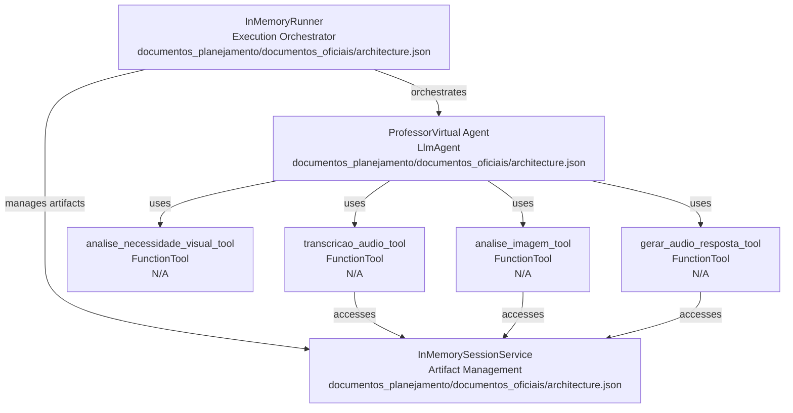
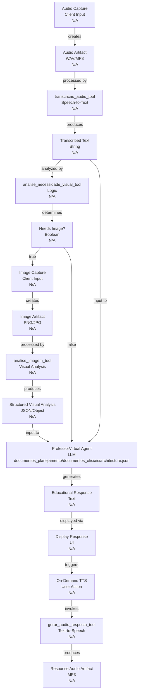
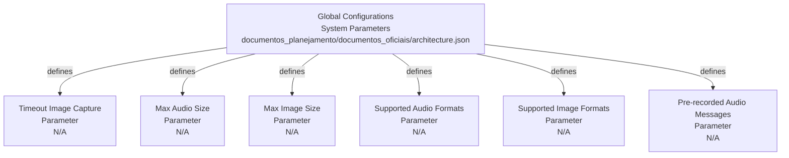

# Codebase Research Report

## Query
Investigate the "architecture.json" component in detail. Focus your analysis on these key files:
1. architecture.json (documentos_planejamento/documentos_oficiais/architecture.json)

Provide insights about the component's main responsibilities and functionality and how it integrates with other system components

## Answer
# Architecture Overview: ProfessorVirtual Agent

The `architecture.json` file [architecture.json](documentos_planejamento/documentos_oficiais/architecture.json) defines the core architecture and operational flow of the **ProfessorVirtual** agent, an intelligent educational agent designed to process audio and, when necessary, image-based questions from children, providing structured educational responses. This document serves as a blueprint for its implementation within the ADK (Agent Development Kit) framework.

## High-Level Architecture

The **ProfessorVirtual** agent is built as an `LlmAgent` [architecture.json](documentos_planejamento/documentos_oficiais/architecture.json) within the ADK, leveraging a Large Language Model (LLM) to process transcribed audio and visual context. Its primary responsibility is to act as an intelligent tutor, providing educational answers. It integrates with several specialized tools for input processing (audio transcription, visual analysis) and output generation (audio response). The agent's execution is managed by an `InMemoryRunner` [architecture.json](documentos_planejamento/documentos_oficiais/architecture.json), which orchestrates the flow of information and tool calls, while an `InMemorySessionService` [architecture.json](documentos_planejamento/documentos_oficiais/architecture.json) handles the storage and retrieval of artifacts (audio, images) during a session.

### Core Components

*   **ProfessorVirtual Agent** (`LlmAgent`):
    *   **Purpose:** The central intelligence unit responsible for understanding user queries (from transcribed audio and analyzed images) and generating educational responses.
    *   **Internal Parts:** Configured with a specific LLM (`gemini-2.5-flash`) and a set of tools it can invoke. It uses an `instruction` template (`professor_instructions_template`) to guide its behavior.
    *   **External Relationships:** Interacts with various `FunctionTool` instances for specific tasks and relies on the `InMemoryRunner` for execution and the `InMemorySessionService` for artifact management.

*   **Tools** (`FunctionTool`): These are specialized functions exposed to the `ProfessorVirtual` agent to perform specific tasks.
    *   **transcricao_audio_tool**:
        *   **Purpose:** Converts audio artifacts into text using speech-to-text services.
        *   **Internal Parts:** Encapsulates the `transcrever_audio` function.
        *   **External Relationships:** Takes an audio artifact name as input and outputs transcribed text, which is then used by the `ProfessorVirtual` agent.
    *   **analise_necessidade_visual_tool**:
        *   **Purpose:** Analyzes transcribed text to determine if visual context (an image) is required for a complete answer.
        *   **Internal Parts:** Encapsulates the `analisar_necessidade_visual` function.
        *   **External Relationships:** Receives transcribed text and outputs a boolean indicating the need for an image, influencing the subsequent workflow steps.
    *   **analise_imagem_tool**:
        *   **Purpose:** Processes image artifacts to extract relevant educational information.
        *   **Internal Parts:** Encapsulates the `analisar_imagem_educacional` function.
        *   **External Relationships:** Takes an image artifact name and question context as input, providing structured visual analysis to the `ProfessorVirtual` agent.
    *   **gerar_audio_resposta_tool**:
        *   **Purpose:** Generates text-to-speech (TTS) audio responses on demand.
        *   **Internal Parts:** Encapsulates the `gerar_audio_tts` function.
        *   **External Relationships:** Receives the educational text response from the agent and outputs the name of the generated audio artifact for client playback.

*   **session_service** (`InMemorySessionService`):
    *   **Purpose:** Manages in-memory sessions, primarily for storing and retrieving artifacts (audio and images) during a user interaction.
    *   **Internal Parts:** A simple in-memory implementation suitable for prototyping.
    *   **External Relationships:** Provides artifact storage and retrieval capabilities to the `InMemoryRunner` and the tools.

*   **runner** (`InMemoryRunner`):
    *   **Purpose:** Executes the `ProfessorVirtual` agent and orchestrates the overall workflow.
    *   **Internal Parts:** Configured to run the `professor_virtual` agent within the `ProfessorVirtualApp` context.
    *   **External Relationships:** Interacts with the `ProfessorVirtual` agent and the `InMemorySessionService` to manage the flow of information and tool execution.

## Main Workflow (`fluxo_principal`)

The `fluxo_principal` [architecture.json](documentos_planejamento/documentos_oficiais/architecture.json) section details the sequential steps of interaction, from user input to agent response.

1.  **Audio Capture and Artifact Creation**: Triggered when the user releases the microphone button. The client sends audio bytes, and the `Runner` creates an audio artifact (e.g., `pergunta_aluno_123.wav`) in the session.
2.  **Audio Processing**: The `transcricao_audio_tool` is invoked with the audio artifact name, producing `texto_transcrito`.
3.  **Visual Analysis**: The `analise_necessidade_visual_tool` analyzes the `texto_transcrito` to determine if an image is needed, resulting in `necessita_imagem_boolean`.
4.  **Conditional Image Capture and Artifact Creation**: If `necessita_imagem` is true, the client captures an image, and the `Runner` creates an image artifact (e.g., `exercicio_abc.png`). Otherwise, the process proceeds directly to response generation.
5.  **Image Processing**: If an image artifact was created, the `analise_imagem_tool` processes it along with the question context, yielding `analise_visual_estruturada`.
6.  **Response Generation**: The `professor_virtual` agent receives a prompt containing the `texto_transcrito` and a reference to the image artifact (if present). It generates a `resposta_educativa_estruturada`.
7.  **Presentation**: The educational response is displayed as text, a pre-recorded audio notification is played, and a play button for on-demand TTS is shown.
8.  **On-Demand TTS Generation**: When the user clicks the play button, the `gerar_audio_resposta_tool` is called with the educational text, producing a new audio artifact (e.g., `resposta_xyz.mp3`) for client playback.

## Global Configurations (`configuracoes_globais`)

The `configuracoes_globais` [architecture.json](documentos_planejamento/documentos_oficiais/architecture.json) section defines various system-wide parameters, including timeouts for image capture, maximum audio and image sizes, supported audio and image formats, and pre-recorded audio messages for different scenarios. These configurations ensure consistent behavior and resource management across the agent's operations.

---
*Generated by [CodeViz.ai](https://codeviz.ai) on 22/07/2025, 06:38:18*
