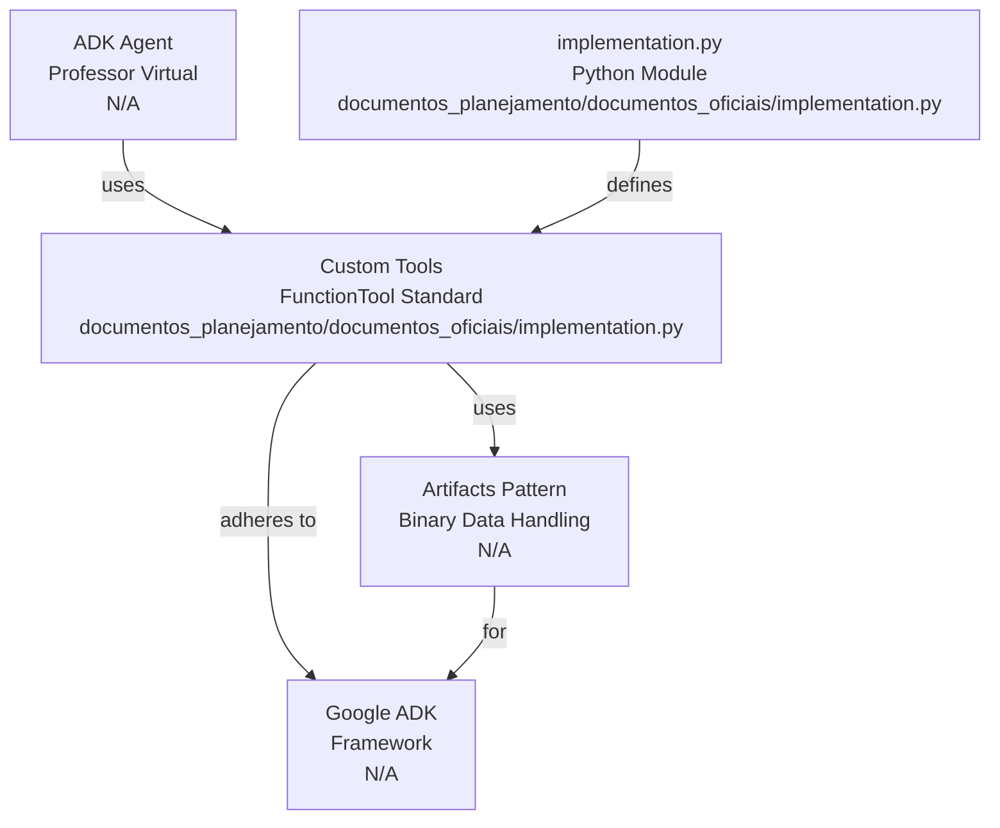

# Codebase Research Report

## Query
Investigate the "implementation.py" component in detail. Focus your analysis on these key files:
1. implementation.py (documentos_planejamento/documentos_oficiais/implementation.py)

Provide insights about the component's main responsibilities and functionality and how it integrates with other system components

## Answer
# Codebase Analysis Report: `implementation.py`

## High-Level Overview: `implementation.py`




The `implementation.py` file ([implementation.py](documentos_planejamento/documentos_oficiais/implementation.py)) serves as a central module for defining **custom tools** specifically designed for the **Professor Virtual ADK** (Agent Development Kit). Its primary responsibility is to encapsulate functionalities that allow the ADK agent to interact with various modalities (audio, visual) and generate responses (text-to-speech). All tools within this module adhere to the `FunctionTool` standard of the Google ADK and utilize the **Artifacts** pattern for handling binary data.

## Component Details: `implementation.py`

```mermaid
graph TB
  implementationPy["implementation.py<br>Python Module<br>documentos_planejamento/documentos_oficiais/implementation.py"]
  toolContext["ToolContext<br>ADK Framework<br>google.adk.tools"]
  sessionArtifacts["Session Artifacts<br>Binary Data<br>N/A"]
  functionTool["FunctionTool<br>ADK Standard<br>N/A"]
  professorToolsDict["PROFESSOR_TOOLS<br>Tool Registry<br>documentos_planejamento/documentos_oficiais/implementation.py:229"]

  transcreverAudio["transcrever_audio()<br>Custom Tool<br>documentos_planejamento/documentos_oficiais/implementation.py:30"]
  analisarNecessidadeVisual["analisar_necessidade_visual()<br>Custom Tool<br>documentos_planejamento/documentos_oficiais/implementation.py:89"]
  analisarImagemEducacional["analisar_imagem_educacional()<br>Custom Tool<br>documentos_planejamento/documentos_oficiais/implementation.py:130"]
  gerarAudioTts["gerar_audio_tts()<br>Custom Tool<br>documentos_planejamento/documentos_oficiais/implementation.py:186"]
  extrairContextoEducacional["extrair_contexto_educacional()<br>Utility Function<br>documentos_planejamento/documentos_oficiais/implementation.py:210"]

  implementationPy --> |"defines"| transcreverAudio
  implementationPy --> |"defines"| analisarNecessidadeVisual
  implementationPy --> |"defines"| analisarImagemEducacional
  implementationPy --> |"defines"| gerarAudioTts
  implementationPy --> |"defines"| extrairContextoEducacional

  transcreverAudio --> |"accesses"| sessionArtifacts
  analisarImagemEducacional --> |"accesses"| sessionArtifacts
  gerarAudioTts --> |"creates"| sessionArtifacts

  toolContext --> |"provides access to"| sessionArtifacts
  transcreverAudio --> |"uses"| toolContext
  analisarImagemEducacional --> |"uses"| toolContext
  gerarAudioTts --> |"uses"| toolContext

  transcreverAudio --> |"output text to"| analisarNecessidadeVisual
  analisarNecessidadeVisual --> |"returns"| "AnaliseVisualResult<br>Dataclass<br>documentos_planejamento/documentos_oficiais/implementation.py:19"
  analisarImagemEducacional --> |"returns"| "AnaliseImagemResult<br>Dataclass<br>documentos_planejamento/documentos_oficiais/implementation.py:25"

  gerarAudioTts --> |"input text from"| "Agent Response<br>Text<br>N/A"

  professorToolsDict --> |"registers"| transcreverAudio
  professorToolsDict --> |"registers"| analisarNecessidadeVisual
  professorToolsDict --> |"registers"| analisarImagemEducacional
  professorToolsDict --> |"registers"| gerarAudioTts

  transcreverAudio --> |"adheres to"| functionTool
  analisarNecessidadeVisual --> |"adheres to"| functionTool
  analisarImagemEducacional --> |"adheres to"| functionTool
  gerarAudioTts --> |"adheres to"| functionTool
```


This module defines several key functions, each acting as a custom tool for the ADK agent. These tools are registered under the `PROFESSOR_TOOLS` dictionary ([implementation.py](documentos_planejamento/documentos_oficiais/implementation.py:229)).

### Core Tools and Functionality

1.  **`transcrever_audio`** ([implementation.py](documentos_planejamento/documentos_oficiais/implementation.py:30))
    *   **Purpose:** Transcribes an audio artifact (e.g., a child's question) into text, enabling the agent to understand spoken input.
    *   **Internal Parts:**
        *   Accesses audio content from a session artifact using `tool_context.session.get_artifact()`.
        *   Performs basic validations on audio format (e.g., "wav", "mp3", "m4a") and size (max 10MB).
        *   Contains a **simulated business logic** for speech-to-text conversion; in a production environment, this would integrate with a real STT service.
    *   **External Relationships:** Integrates with the ADK framework via `ToolContext` to retrieve audio artifacts.

2.  **`analisar_necessidade_visual`** ([implementation.py](documentos_planejamento/documentos_oficiais/implementation.py:89))
    *   **Purpose:** Analyzes transcribed text to detect if it contains references that imply a need for visual input (e.g., "look at this picture").
    *   **Internal Parts:**
        *   Uses regular expressions (`re` module) to search for predefined visual patterns and keywords (e.g., "figure", "image", "exercise").
        *   Calculates a confidence score based on detected patterns.
        *   Returns an `AnaliseVisualResult` dataclass ([implementation.py](documentos_planejamento/documentos_oficiais/implementation.py:19)) indicating whether an image is needed.
    *   **External Relationships:** Takes `text` as input, typically from the output of `transcrever_audio`. Does not directly interact with ADK artifacts.

3.  **`analisar_imagem_educacional`** ([implementation.py](documentos_planejamento/documentos_oficiais/implementation.py:130))
    *   **Purpose:** Extracts educationally relevant information from an image artifact (e.g., a photo of an exercise or textbook page).
    *   **Internal Parts:**
        *   Accesses image content from a session artifact using `tool_context.session.get_artifact()`.
        *   Performs basic validations on image size (max 5MB).
        *   Contains a **simulated business logic** for image analysis; in a production environment, this would integrate with a real vision service.
        *   Returns an `AnaliseImagemResult` dataclass ([implementation.py](documentos_planejamento/documentos_oficiais/implementation.py:25)) with details like content type, detected elements, and educational context.
    *   **External Relationships:** Integrates with the ADK framework via `ToolContext` to retrieve image artifacts.

4.  **`gerar_audio_tts`** ([implementation.py](documentos_planejamento/documentos_oficiais/implementation.py:186))
    *   **Purpose:** Converts a given text (e.g., the agent's response) into an audio artifact using Text-to-Speech (TTS) services.
    *   **Internal Parts:**
        *   Generates a unique artifact name using `uuid`.
        *   Contains a **simulated business logic** for TTS conversion; in a production environment, this would integrate with a real TTS service to obtain actual audio bytes.
        *   Creates a new audio artifact in the current session using `tool_context.session.create_artifact()`.
    *   **External Relationships:** Integrates with the ADK framework via `ToolContext` to create new audio artifacts that can then be retrieved and played by the client application.

### Auxiliary Functions

*   **`extrair_contexto_educacional`** ([implementation.py](documentos_planejamento/documentos_oficiais/implementation.py:210))
    *   **Purpose:** Extracts educational context (e.g., probable subject matter, complexity level) from a given text.
    *   **Internal Parts:** Uses keyword matching against a predefined dictionary of subjects and associated keywords.
    *   **External Relationships:** A utility function that could be used internally by other tools or agents to categorize text input.

### Integration with ADK Framework

The module heavily relies on the **Google ADK** framework, specifically:
*   **`ToolContext`**: Passed to each tool function, providing access to the current session and its artifacts ([implementation.py](google.adk.tools)). This is the primary mechanism for tools to interact with the ADK environment, allowing them to retrieve and create binary data (artifacts).
*   **`FunctionTool`**: The tools are designed to be compatible with the `FunctionTool` standard, implying they are callable functions that the ADK agent can invoke based on its reasoning.
*   **Artifacts**: The core mechanism for handling binary data (audio, images). Tools either `get_artifact` (e.g., `transcrever_audio`, `analisar_imagem_educacional`) or `create_artifact` (e.g., `gerar_audio_tts`) to process or generate binary content.

The `PROFESSOR_TOOLS` dictionary ([implementation.py](documentos_planejamento/documentos_oficiais/implementation.py:229)) explicitly registers these functions, making them discoverable and usable by an ADK agent.

---
*Generated by [CodeViz.ai](https://codeviz.ai) on 22/07/2025, 06:39:10*
