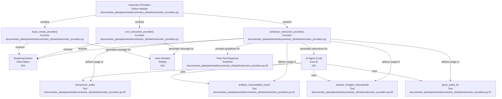

# Codebase Research Report

## Query
Investigate the "instruction_providers.py" component in detail. Focus your analysis on these key files:
1. instruction_providers.py (documentos_planejamento/documentos_oficiais/instruction_providers.py)

Provide insights about the component's main responsibilities and functionality and how it integrates with other system components

## Answer
# Codebase Analysis Report: `instruction_providers.py`

This report details the `instruction_providers.py` component, focusing on its responsibilities, functionality, and integration within the system.

## Component: `instruction_providers.py`

The [instruction_providers.py](documentos_planejamento/documentos_oficiais/instruction_providers.py) file serves as a central hub for generating dynamic instructions and messages within the Professor Virtual ADK system. Its primary responsibility is to provide context-aware directives to the main AI agent (LLM) and user-facing messages, adapting to session states and user interactions.

### Internal Structure and Key Functions

The component is structured around several Python functions, each responsible for generating a specific type of instruction or message:

*   **`professor_instruction_provider(context: ReadonlyContext) -> str`**:
    *   **Purpose**: This is the core instruction provider for the main AI agent. It generates the primary mission, behavior guidelines, and tool usage rules for the "Professor Virtual."
    *   **Internal Parts**: It extracts user-specific data like `user_name` and `serie_escolar` from the provided `context` to personalize the instructions.
    *   **External Relationships**: It receives a `ReadonlyContext` object, which provides access to the current session state. The generated instruction string is intended to be fed directly to the LLM.
    *   **Functionality**:
        *   Defines the AI's persona as a "friendly, patient, and encouraging educational assistant."
        *   Outlines strict rules for tool usage, including:
            *   [Audio transcription](documentos_planejamento/documentos_oficiais/instruction_providers.py:25) (`transcrever_audio`)
            *   [Visual necessity analysis](documentos_planejamento/documentos_oficiais/instruction_providers.py:31) (`analisar_necessidade_visual`)
            *   [Educational image analysis](documentos_planejamento/documentos_oficiais/instruction_providers.py:40) (`analisar_imagem_educacional`)
            *   [Response audio generation](documentos_planejamento/documentos_oficiais/instruction_providers.py:47) (`gerar_audio_tts`)
        *   Provides [guidelines for the final text response](documentos_planejamento/documentos_oficiais/instruction_providers.py:52) to the student, emphasizing language, structure, and patience.

*   **`erro_instruction_provider(context: ReadonlyContext) -> str`**:
    *   **Purpose**: Generates user-friendly error messages based on the type of processing error encountered.
    *   **Internal Parts**: Retrieves `tipo_erro` from the `context` to customize the error message.
    *   **External Relationships**: Receives a `ReadonlyContext` object. The generated message is intended for direct display to the user.

*   **`boas_vindas_provider(context: ReadonlyContext) -> str`**:
    *   **Purpose**: Generates welcome messages for the student, adapting based on whether it's the first interaction.
    *   **Internal Parts**: Checks `primeira_interacao` and `user_name` from the `context`.
    *   **External Relationships**: Receives a `ReadonlyContext` object. The generated message is intended for direct display to the user.

### Integration with Other System Components

The `instruction_providers.py` component integrates with other parts of the Professor Virtual ADK system primarily through the `INSTRUCTION_PROVIDERS` dictionary and the `ReadonlyContext` object:

*   **`INSTRUCTION_PROVIDERS` Dictionary**: This dictionary, defined at the end of the [instruction_providers.py](documentos_planejamento/documentos_oficiais/instruction_providers.py:100) file, maps symbolic names (e.g., `"professor_instructions"`, `"erro_processamento"`) to their respective instruction-generating functions. This allows other parts of the application (likely a "runner" or orchestration layer) to easily access and call the appropriate instruction provider based on the current system state or user interaction.

*   **`ReadonlyContext`**: All instruction provider functions accept a `context` object of type `ReadonlyContext`. This object provides a read-only view of the current session state, allowing the instruction providers to dynamically tailor their output based on user information, previous interactions, or system events. This promotes a highly adaptive and personalized user experience.

*   **Tool Integration**: The `professor_instruction_provider` explicitly defines how the AI agent should interact with various tools (e.g., `transcrever_audio`, `analisar_imagem_educacional`). This implies that there are separate tool implementations elsewhere in the system that the AI agent is instructed to use. The instructions generated here guide the AI's decision-making process regarding when and how to invoke these tools.

*   **LLM Interaction**: The primary output of `professor_instruction_provider` is a detailed instruction string for the Large Language Model (LLM). This string acts as a prompt, guiding the LLM's behavior, reasoning, and response generation. This indicates a clear separation of concerns, where `instruction_providers.py` is responsible for crafting the LLM's operational guidelines, while the LLM itself handles the conversational logic and content generation based on these guidelines.

---
*Generated by [CodeViz.ai](https://codeviz.ai) on 22/07/2025, 06:39:35*
