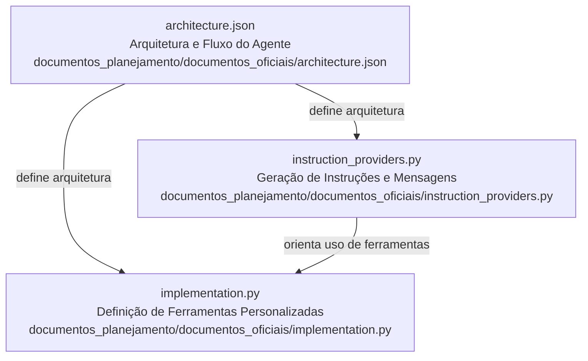

# Documentos Oficiais para Implementação de Agente

Este documento descreve o propósito e o papel dos artefatos em `documentos_planejamento/documentos_oficiais`, que norteiam a arquitetura, a implementação e as instruções de operação do agente ProfessorVirtual.

## Visão Geral dos Documentos

O diretório `documentos_planejamento/documentos_oficiais` contém três arquivos principais que servem de base para a arquitetura, implementação e fornecimento de instruções para o agente.

### architecture.json

* **Propósito:** Define o núcleo da arquitetura e o fluxo operacional do agente **ProfessorVirtual**, incluindo os componentes `LlmAgent`, `FunctionTool`, `InMemoryRunner` e `InMemorySessionService`, e como eles se interconectam para processar áudio e imagem, gerar respostas e gerenciar artefatos.  
* **Partes Internas:** Contém a especificação dos agentes e ferramentas (`transcricao_audio_tool`, `analise_necessidade_visual_tool`, `analise_imagem_tool`, `gerar_audio_resposta_tool`), além das configurações globais e do fluxo principal de interação.  
* **Relações Externas:** Serve de blueprint para a implementação das ferramentas em `implementation.py` e para a geração de instruções em `instruction_providers.py`, alinhando o código ao design arquitetural.【F:documentos_planejamento/documentos_oficiais/architecture_overview_professorvirtual_agent_2025-07-22T09-38-18.md†L8-L16】【F:documentos_planejamento/documentos_oficiais/architecture_overview_professorvirtual_agent_2025-07-22T09-38-18.md†L33-L49】

### implementation.py

* **Propósito:** Define as **ferramentas personalizadas** (custom tools) do agente, implementando funções de transcrição de áudio, análise de necessidade visual, análise educacional de imagens e geração de áudio via TTS, seguindo o padrão `FunctionTool` do Google ADK e utilizando o `ToolContext` para acesso a artefatos.  
* **Partes Internas:**  
  * `transcrever_audio(text: str)`: obtem artefato de áudio da sessão, valida formato/size e simula transcrição para texto.  
  * `analisar_necessidade_visual(text: str)`: detecta no conteúdo textual a necessidade de contexto visual, retornando `AnaliseVisualResult`.  
  * `analisar_imagem_educacional(image_name: str, question: str)`: obtém artefato de imagem, valida tamanho e simula extração de informações educacionais, retornando `AnaliseImagemResult`.  
  * `gerar_audio_tts(text: str)`: gera um artefato de áudio TTS via UUID, criando-o na sessão.  
  * `extrair_contexto_educacional(text: str)`: função utilitária para identificar assunto e nível a partir de palavras-chave.  
* **Relações Externas:** Registra as ferramentas em `PROFESSOR_TOOLS` e integra-se ao ADK por meio de `ToolContext.session` para `get_artifact` e `create_artifact`, fornecendo as funcionalidades exigidas pelas instruções do agente.【F:documentos_planejamento/documentos_oficiais/codebase_analysis_report_implementationpy_2025-07-22T09-39-10.md†L21-L61】【F:documentos_planejamento/documentos_oficiais/codebase_analysis_report_implementationpy_2025-07-22T09-39-10.md†L63-L112】

### instruction_providers.py

* **Propósito:** Gera dinamicamente **instruções** e **mensagens** para orientar o comportamento do agente (LLM) e a interação com o usuário, definindo persona, regras de uso de ferramentas e texto de erro/boas-vindas.  
* **Partes Internas:**  
  * `professor_instruction_provider(context: ReadonlyContext) -> str`: cria o prompt principal para o LLM, incluindo identidade como tutor, regras de uso de cada ferramenta (`transcrever_audio`, `analisar_necessidade_visual`, `analisar_imagem_educacional`, `gerar_audio_tts`) e diretrizes de resposta.  
  * `erro_instruction_provider(context: ReadonlyContext) -> str`: retorna mensagens de erro amigáveis com base no tipo de exceção.  
  * `boas_vindas_provider(context: ReadonlyContext) -> str`: produz mensagens de boas-vindas personalizadas de acordo com interação.  
  * `INSTRUCTION_PROVIDERS`: dicionário que mapeia chaves semânticas aos provedores, permitindo que o runner invoque a função adequada conforme o estado da sessão.  
* **Relações Externas:** Consumido pelo runner/orquestrador do agente, que injeta o `ReadonlyContext`, e orienta o LLM quanto ao uso das ferramentas definidas em `implementation.py`.【F:documentos_planejamento/documentos_oficiais/codebase_analysis_report_instructionproviderspy_2025-07-22T09-39-35.md†L19-L60】【F:documentos_planejamento/documentos_oficiais/codebase_analysis_report_instructionproviderspy_2025-07-22T09-39-35.md†L62-L111】

---
*Generated by [CodeViz.ai](https://codeviz.ai) on 22/07/2025, 06:36:00*
